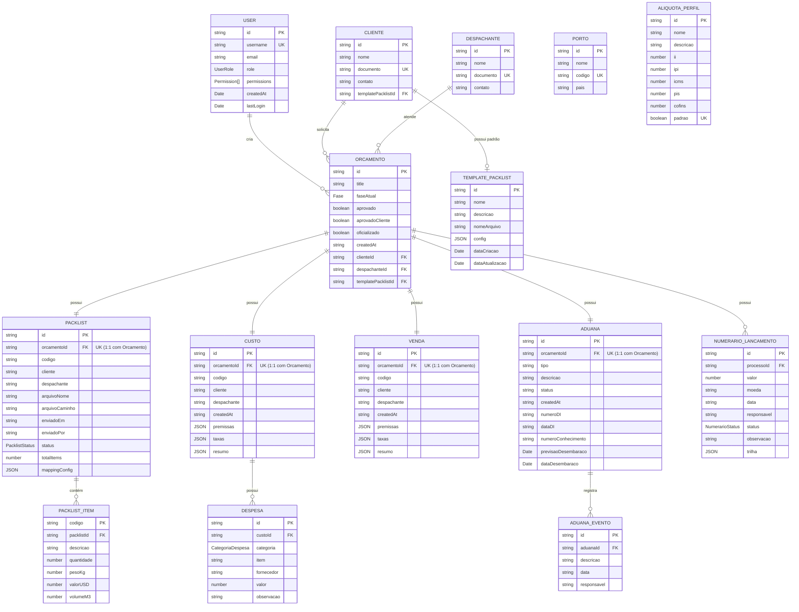

# Database Design - Modelo de Dados e Relacionamentos

## Informações do Documento

- **Versão:** 1.0.0
- **Data:** Janeiro 2026
- **Tipo:** Documentação Técnica - Arquitetura de Dados
- **Storage:** localStorage (Cliente-Side)
- **Normalização:** 3NF (Third Normal Form)

---

## 1. Visão Geral da Arquitetura

### 1.1 Estratégia de Persistência

O sistema utiliza **localStorage** como camada de persistência para o MVP, com toda a lógica relacional implementada **no código TypeScript** através de repositórios e serviços.

**Características:**
- Cada entidade possui sua própria chave no localStorage
- Relacionamentos são gerenciados via Foreign Keys (IDs referenciados)
- Integridade referencial é garantida pela camada de serviço
- Não há constraints nativos (implementados manualmente no código)

### 1.2 Padrão de Implementação

```
┌─────────────────┐
│   Component     │
└────────┬────────┘
         │
         ▼
┌─────────────────┐
│    Service      │ ◄─── Lógica de negócio e validações
└────────┬────────┘
         │
         ▼
┌─────────────────┐
│   Repository    │ ◄─── CRUD + integridade referencial
└────────┬────────┘
         │
         ▼
┌─────────────────┐
│  localStorage   │ ◄─── Persistência JSON
└─────────────────┘
```

---

## 2. Diagrama Entidade-Relacionamento (ER)

### 2.1 Diagrama Mermaid



### 2.2 Cardinalidades

| Relacionamento | Tipo | Descrição |
|---------------|------|-----------|
| USER → ORCAMENTO | 1:N | Um usuário cria múltiplos orçamentos |
| CLIENTE → ORCAMENTO | 1:N | Um cliente solicita múltiplos orçamentos |
| CLIENTE → TEMPLATE_PACKLIST | 1:1 opcional | Cliente pode ter template padrão |
| DESPACHANTE → ORCAMENTO | 1:N | Um despachante atende múltiplos orçamentos |
| ORCAMENTO → PACKLIST | 1:1 | Cada orçamento tem exatamente um packlist |
| ORCAMENTO → CUSTO | 1:1 | Cada orçamento tem exatamente um custo |
| ORCAMENTO → VENDA | 1:1 | Cada orçamento tem exatamente uma venda |
| ORCAMENTO → ADUANA | 1:1 | Cada orçamento tem exatamente uma aduana |
| ORCAMENTO → NUMERARIO | 1:N | Um orçamento pode ter múltiplos lançamentos |
| PACKLIST → PACKLIST_ITEM | 1:N | Um packlist contém múltiplos itens |
| CUSTO → DESPESA | 1:N | Um custo possui múltiplas despesas |
| ADUANA → ADUANA_EVENTO | 1:N | Uma aduana registra múltiplos eventos |

---

## 3. Entidades e Atributos Detalhados

### 3.1 Entidades de Cadastro Base

#### USER (Usuários)

**Localização:** `src/app/features/auth/domain/auth.models.ts`

| Campo | Tipo | Constraints | Descrição |
|-------|------|-------------|-----------|
| id | string | PK, NOT NULL, UNIQUE | Identificador único |
| username | string | NOT NULL, UNIQUE | Nome de usuário para login |
| email | string | NULL | Email do usuário |
| role | UserRole | NOT NULL | Papel: admin, cliente, despachante, maritimo |
| permissions | Permission[] | NOT NULL | Lista de permissões granulares |
| createdAt | Date | NULL | Data de criação |
| lastLogin | Date | NULL | Último acesso |

**Índices:**
- PRIMARY KEY: `id`
- UNIQUE INDEX: `username`

**Regras de Negócio:**
- `role` determina conjunto padrão de `permissions`
- `admin` tem todas as permissões
- `cliente` tem acesso limitado (read-only em algumas áreas)
- `despachante` tem acesso à fase de Aduana
- `maritimo` tem acesso limitado à fase de Venda

---

#### CLIENTE (Clientes)

**Localização:** `src/app/domain/cliente.models.ts`

| Campo | Tipo | Constraints | Descrição |
|-------|------|-------------|-----------|
| id | string | PK, NOT NULL, UNIQUE | Identificador único |
| nome | string | NOT NULL | Razão social ou nome |
| documento | string | NOT NULL, UNIQUE | CNPJ ou CPF |
| contato | string | NOT NULL | Telefone, email, etc |
| templatePacklistId | string | FK, NULL | Referência ao template padrão |

**Foreign Keys:**
- `templatePacklistId` → `TEMPLATE_PACKLIST.id` (ON DELETE SET NULL)

**Índices:**
- PRIMARY KEY: `id`
- UNIQUE INDEX: `documento`
- FOREIGN KEY INDEX: `templatePacklistId`

**Regras de Negócio:**
- `documento` deve ser válido (CPF/CNPJ)
- Se `templatePacklistId` fornecido, deve existir em TEMPLATE_PACKLIST
- Não pode ser deletado se tiver orçamentos vinculados (soft delete recomendado)

---

#### DESPACHANTE (Despachantes)

**Localização:** `src/app/domain/despachante.models.ts`

| Campo | Tipo | Constraints | Descrição |
|-------|------|-------------|-----------|
| id | string | PK, NOT NULL, UNIQUE | Identificador único |
| nome | string | NOT NULL | Nome ou razão social |
| documento | string | NOT NULL, UNIQUE | CPF ou CNPJ |
| contato | string | NOT NULL | Telefone, email, etc |

**Índices:**
- PRIMARY KEY: `id`
- UNIQUE INDEX: `documento`

**Regras de Negócio:**
- `documento` deve ser válido
- Não pode ser deletado se tiver orçamentos vinculados

---

#### PORTO (Portos)

**Localização:** `src/app/domain/porto.models.ts`

| Campo | Tipo | Constraints | Descrição |
|-------|------|-------------|-----------|
| id | string | PK, NOT NULL, UNIQUE | Identificador único |
| nome | string | NOT NULL | Nome do porto |
| codigo | string | NOT NULL, UNIQUE | Código internacional (ex: BRSAO) |
| pais | string | NOT NULL | País do porto |

**Índices:**
- PRIMARY KEY: `id`
- UNIQUE INDEX: `codigo`

**Regras de Negócio:**
- `codigo` deve seguir padrão UN/LOCODE (5 caracteres)
- Não pode ser deletado se referenciado em premissas de custo

---

#### ALIQUOTA_PERFIL (Perfis de Alíquotas)

**Localização:** `src/app/domain/aliquota.models.ts`

| Campo | Tipo | Constraints | Descrição |
|-------|------|-------------|-----------|
| id | string | PK, NOT NULL, UNIQUE | Identificador único |
| nome | string | NOT NULL | Nome do perfil |
| descricao | string | NULL | Descrição opcional |
| ii | number | NOT NULL, >= 0, <= 100 | Imposto de Importação (%) |
| ipi | number | NOT NULL, >= 0, <= 100 | IPI (%) |
| icms | number | NOT NULL, >= 0, <= 100 | ICMS (%) |
| pis | number | NOT NULL, >= 0, <= 100 | PIS (%) |
| cofins | number | NOT NULL, >= 0, <= 100 | COFINS (%) |
| padrao | boolean | NOT NULL | Se é o perfil padrão |

**Índices:**
- PRIMARY KEY: `id`
- UNIQUE INDEX: `padrao WHERE padrao = true` (apenas um padrão)

**Regras de Negócio:**
- Percentuais devem estar entre 0 e 100
- Apenas um perfil pode ter `padrao = true`
- Ao criar novo perfil padrão, desmarcar o anterior

---

#### TEMPLATE_PACKLIST (Templates de Packlist)

**Localização:** `src/app/features/templates-packlist/models/templates-packlist.models.ts`

| Campo | Tipo | Constraints | Descrição |
|-------|------|-------------|-----------|
| id | string | PK, NOT NULL, UNIQUE | Identificador único |
| nome | string | NOT NULL | Nome do template |
| descricao | string | NULL | Descrição |
| nomeArquivo | string | NOT NULL | Nome/path do arquivo de referência |
| config | JSON | NOT NULL | Configuração de mapeamento |
| dataCriacao | Date | NOT NULL | Data de criação |
| dataAtualizacao | Date | NOT NULL | Data de última atualização |

**Estrutura de `config` (JSON):**
```typescript
{
  linhaInicio: number,
  fieldMapping: {
    numeroSequencial?: string,
    volumes?: string,
    peso?: string,
    cbm?: string,
    descricaoComercial?: string
  }
}
```

**Índices:**
- PRIMARY KEY: `id`

**Regras de Negócio:**
- `config.linhaInicio` deve ser >= 1
- `fieldMapping` deve ter pelo menos um campo mapeado
- Não pode ser deletado se vinculado a clientes ou orçamentos

---

### 3.2 Entidade Principal

#### ORCAMENTO (Orçamentos/Processos)

**Localização:** `src/app/features/orcamento/models/orcamento.models.ts`

| Campo | Tipo | Constraints | Descrição |
|-------|------|-------------|-----------|
| id | string | PK, NOT NULL, UNIQUE | Identificador único |
| title | string | NULL | Título/identificação do processo |
| faseAtual | Fase | NOT NULL | 'Orcamento' ou 'Aduana' |
| aprovado | boolean | NULL | Aprovação interna |
| aprovadoCliente | boolean | NULL | Aprovação do cliente |
| oficializado | boolean | NULL | Processo oficializado |
| createdAt | string | NOT NULL | Data de criação (ISO 8601) |
| clienteId | string | FK, NULL | Referência ao cliente |
| despachanteId | string | FK, NULL | Referência ao despachante |
| templatePacklistId | string | FK, NULL | Template utilizado |

**Foreign Keys:**
- `clienteId` → `CLIENTE.id` (ON DELETE SET NULL)
- `despachanteId` → `DESPACHANTE.id` (ON DELETE SET NULL)
- `templatePacklistId` → `TEMPLATE_PACKLIST.id` (ON DELETE SET NULL)

**Índices:**
- PRIMARY KEY: `id`
- FOREIGN KEY INDEX: `clienteId`
- FOREIGN KEY INDEX: `despachanteId`
- INDEX: `faseAtual`
- INDEX: `createdAt DESC`

**Regras de Negócio:**
- `faseAtual` inicia como 'Orcamento'
- Transição para 'Aduana' requer todas as 4 fases concluídas
- `clienteId` é obrigatório para criar orçamento
- `despachanteId` é obrigatório para fase de Aduana
- Não pode ser deletado se tiver fases vinculadas (cascade delete)

---

### 3.3 Entidades de Fases (1:1 com Orçamento)

#### PACKLIST (Lista de Embalagem)

**Localização:** `src/app/features/packlist/models/packlist.models.ts`

| Campo | Tipo | Constraints | Descrição |
|-------|------|-------------|-----------|
| id | string | PK, NOT NULL, UNIQUE | Identificador único |
| orcamentoId | string | FK, NOT NULL, UNIQUE | Referência ao orçamento (1:1) |
| codigo | string | NULL | Código do processo |
| cliente | string | NULL | Nome do cliente (desnormalizado) |
| despachante | string | NULL | Nome do despachante (desnormalizado) |
| arquivoNome | string | NULL | Nome do arquivo enviado |
| arquivoCaminho | string | NULL | Caminho/base64 do arquivo |
| enviadoEm | string | NOT NULL | Data de envio (ISO 8601) |
| enviadoPor | string | NULL | Usuário que enviou |
| status | PacklistStatus | NOT NULL | 'concluido', 'em-andamento', 'pendente' |
| totalItems | number | NULL | Total de itens importados |
| mappingConfig | JSON | NULL | Configuração de importação utilizada |

**Foreign Keys:**
- `orcamentoId` → `ORCAMENTO.id` (ON DELETE CASCADE)

**Índices:**
- PRIMARY KEY: `id`
- UNIQUE INDEX: `orcamentoId` (garante 1:1)
- INDEX: `status`

**Regras de Negócio:**
- `orcamentoId` deve ser único (1:1)
- `status = 'concluido'` permite avançar para fase de Custo
- Pode ser finalizado sem arquivo (`arquivoNome` e `arquivoCaminho` NULL)
- Se arquivo enviado, `mappingConfig` deve estar preenchido

---

#### PACKLIST_ITEM (Itens do Packlist)

**Localização:** `src/app/features/packlist/models/packlist.models.ts`

| Campo | Tipo | Constraints | Descrição |
|-------|------|-------------|-----------|
| codigo | string | PK, NOT NULL | Código do item |
| packlistId | string | FK, NOT NULL | Referência ao packlist |
| descricao | string | NOT NULL | Descrição comercial |
| quantidade | number | NOT NULL, > 0 | Quantidade |
| pesoKg | number | NOT NULL, > 0 | Peso em kg |
| valorUSD | number | NOT NULL, > 0 | Valor FOB em USD |
| volumeM3 | number | NULL, > 0 | Volume em m³ |

**Foreign Keys:**
- `packlistId` → `PACKLIST.id` (ON DELETE CASCADE)

**Índices:**
- PRIMARY KEY: `codigo`
- FOREIGN KEY INDEX: `packlistId`

**Regras de Negócio:**
- `quantidade`, `pesoKg`, `valorUSD` devem ser > 0
- `codigo` deve ser único dentro do packlist

---

#### CUSTO (Planilha de Custo)

**Localização:** `src/app/features/custo/models/custo.models.ts`

| Campo | Tipo | Constraints | Descrição |
|-------|------|-------------|-----------|
| id | string | PK, NOT NULL, UNIQUE | Identificador único |
| orcamentoId | string | FK, NOT NULL, UNIQUE | Referência ao orçamento (1:1) |
| codigo | string | NULL | Código do processo |
| cliente | string | NULL | Nome do cliente (desnormalizado) |
| despachante | string | NULL | Nome do despachante (desnormalizado) |
| createdAt | string | NOT NULL | Data de criação (ISO 8601) |
| premissas | JSON | NOT NULL | Premissas comerciais |
| taxas | JSON | NOT NULL | Alíquotas aplicadas |
| resumo | JSON | NOT NULL | Totalizadores calculados |

**Estrutura de `premissas` (JSON):**
```typescript
{
  fobUsd: number,
  freteUsd: number,
  seguroUsd: number,
  thcUsd: number,
  taxaUsd: number,
  quantidade: number,
  ncm: string,
  taxaEur: number,
  pesoLiquido: number,
  quantProdutos: number,
  unidMedida: string,
  estatistica: string,
  volume: number,
  fcl: 'FCL'|'LCL',
  incoterm: 'FOB'|'CIF'|'EXW',
  precoPeca: number,
  porto: string,
  beneficioFiscal: number
}
```

**Estrutura de `taxas` (JSON):**
```typescript
{
  ii: number,
  ipi: number,
  icms: number,
  pis: number,
  cofins: number
}
```

**Estrutura de `resumo` (JSON):**
```typescript
{
  tributos: number,
  desembolsoDesembaraco: number,
  desembolsoTotal: number
}
```

**Foreign Keys:**
- `orcamentoId` → `ORCAMENTO.id` (ON DELETE CASCADE)

**Índices:**
- PRIMARY KEY: `id`
- UNIQUE INDEX: `orcamentoId` (garante 1:1)

**Regras de Negócio:**
- Requer Packlist concluído
- `taxas` geralmente vem de ALIQUOTA_PERFIL
- Cálculos são realizados no serviço (CustoService)
- Totalizadores em `resumo` são derivados (não editáveis)

---

#### DESPESA (Despesas do Custo)

**Localização:** `src/app/domain/planilha.models.ts` e `src/app/features/custo/models/custo.models.ts`

| Campo | Tipo | Constraints | Descrição |
|-------|------|-------------|-----------|
| id | string | PK, NOT NULL, UNIQUE | Identificador único |
| custoId | string | FK, NOT NULL | Referência ao custo |
| categoria | CategoriaDespesa | NOT NULL | 'Agência Marítima', 'Despachante', 'Tributos', 'Porto', 'Outros' |
| item | string | NOT NULL | Descrição da despesa |
| fornecedor | string | NULL | Fornecedor/prestador |
| valor | number | NOT NULL, >= 0 | Valor da despesa |
| observacao | string | NULL | Observações |

**Foreign Keys:**
- `custoId` → `CUSTO.id` (ON DELETE CASCADE)

**Índices:**
- PRIMARY KEY: `id`
- FOREIGN KEY INDEX: `custoId`
- INDEX: `categoria`

**Regras de Negócio:**
- `valor` deve ser >= 0
- `categoria` deve ser um dos valores permitidos

---

#### VENDA (Planilha de Venda)

**Localização:** `src/app/features/venda/models/venda.models.ts`

| Campo | Tipo | Constraints | Descrição |
|-------|------|-------------|-----------|
| id | string | PK, NOT NULL, UNIQUE | Identificador único |
| orcamentoId | string | FK, NOT NULL, UNIQUE | Referência ao orçamento (1:1) |
| codigo | string | NULL | Código do processo |
| cliente | string | NULL | Nome do cliente (desnormalizado) |
| despachante | string | NULL | Nome do despachante (desnormalizado) |
| createdAt | string | NOT NULL | Data de criação (ISO 8601) |
| premissas | JSON | NOT NULL | Premissas (herdadas do Custo) |
| taxas | JSON | NOT NULL | Taxas (herdadas do Custo) |
| resumo | JSON | NOT NULL | Totalizadores de venda |

**Foreign Keys:**
- `orcamentoId` → `ORCAMENTO.id` (ON DELETE CASCADE)

**Índices:**
- PRIMARY KEY: `id`
- UNIQUE INDEX: `orcamentoId` (garante 1:1)

**Regras de Negócio:**
- Requer Custo concluído
- `premissas` e `taxas` são read-only (herdados)
- Despesas de agência marítima são editáveis
- Margem de lucro calculada sobre custo total

---

#### ADUANA (Desembaraço Aduaneiro)

**Localização:** `src/app/features/aduana/models/aduana.models.ts`

| Campo | Tipo | Constraints | Descrição |
|-------|------|-------------|-----------|
| id | string | PK, NOT NULL, UNIQUE | Identificador único |
| orcamentoId | string | FK, NOT NULL, UNIQUE | Referência ao orçamento (1:1) |
| tipo | string | NULL | Tipo de processo |
| descricao | string | NULL | Descrição |
| status | string | NULL | Status atual |
| createdAt | string | NOT NULL | Data de criação (ISO 8601) |
| numeroDI | string | NULL | Número da Declaração de Importação |
| dataDI | string | NULL | Data de registro da DI |
| numeroConhecimento | string | NULL | Número do BL/AWB |
| previsaoDesembaraco | Date | NULL | Previsão de liberação |
| dataDesembaraco | Date | NULL | Data efetiva de liberação |

**Foreign Keys:**
- `orcamentoId` → `ORCAMENTO.id` (ON DELETE CASCADE)

**Índices:**
- PRIMARY KEY: `id`
- UNIQUE INDEX: `orcamentoId` (garante 1:1)
- INDEX: `numeroDI`
- INDEX: `status`

**Regras de Negócio:**
- Requer Venda concluída
- `numeroDI` deve ser único quando informado
- `dataDesembaraco` marca conclusão da fase
- `despachanteId` deve estar preenchido no ORCAMENTO

---

#### ADUANA_EVENTO (Eventos da Aduana)

**Localização:** `src/app/features/aduana/pages/aduana-detail.component.ts`

| Campo | Tipo | Constraints | Descrição |
|-------|------|-------------|-----------|
| id | string | PK, NOT NULL, UNIQUE | Identificador único |
| aduanaId | string | FK, NOT NULL | Referência à aduana |
| descricao | string | NOT NULL | Descrição do evento |
| data | string | NOT NULL | Data do evento (ISO 8601) |
| responsavel | string | NULL | Responsável pelo evento |

**Foreign Keys:**
- `aduanaId` → `ADUANA.id` (ON DELETE CASCADE)

**Índices:**
- PRIMARY KEY: `id`
- FOREIGN KEY INDEX: `aduanaId`
- INDEX: `data DESC`

**Regras de Negócio:**
- Eventos são imutáveis (não editáveis após criação)
- Ordenação cronológica reversa (mais recente primeiro)

---

### 3.4 Entidade de Controle Financeiro

#### NUMERARIO_LANCAMENTO (Lançamentos de Numerário)

**Localização:** `src/app/domain/numerario.models.ts`

| Campo | Tipo | Constraints | Descrição |
|-------|------|-------------|-----------|
| id | string | PK, NOT NULL, UNIQUE | Identificador único |
| processoId | string | FK, NOT NULL | Referência ao orçamento |
| valor | number | NOT NULL, > 0 | Valor do lançamento |
| moeda | string | NOT NULL | 'BRL', 'USD', 'EUR' |
| data | string | NOT NULL | Data do lançamento (ISO 8601) |
| responsavel | string | NOT NULL | Responsável pelo lançamento |
| status | NumerarioStatus | NOT NULL | 'Solicitado', 'Enviado', 'Pago', 'Recebido' |
| observacao | string | NULL | Observações |
| trilha | JSON | NOT NULL | Histórico de mudanças de status |

**Estrutura de `trilha` (JSON):**
```typescript
[
  { evento: string, data: string },
  ...
]
```

**Foreign Keys:**
- `processoId` → `ORCAMENTO.id` (ON DELETE CASCADE)

**Índices:**
- PRIMARY KEY: `id`
- FOREIGN KEY INDEX: `processoId`
- INDEX: `status`
- INDEX: `data DESC`

**Regras de Negócio:**
- `valor` deve ser > 0
- `moeda` deve ser um dos valores permitidos
- `trilha` registra todas as mudanças de status cronologicamente
- `status` segue fluxo: Solicitado → Enviado → Pago → Recebido

---

## 4. Integridade Referencial

### 4.1 Constraints Implementadas no Código

Como localStorage não oferece constraints nativos, toda integridade é implementada nos **repositórios** e **serviços**.

#### 4.1.1 Foreign Key Constraints

```typescript
// Exemplo: ClienteRepository
delete(id: string): Observable<void> {
  // Verificar se cliente tem orçamentos vinculados
  const orcamentos = this.orcamentoRepo.getAll()
    .filter(orc => orc.clienteId === id);
  
  if (orcamentos.length > 0) {
    throw new Error('Cliente possui orçamentos vinculados');
  }
  
  // Prosseguir com deleção
  return this.storage.delete('clientes', id);
}
```

#### 4.1.2 Cascade Delete

```typescript
// Exemplo: OrcamentoRepository
delete(id: string): Observable<void> {
  // Deletar cascata: Packlist, Custo, Venda, Aduana, Numerario
  return forkJoin([
    this.packlistRepo.deleteByOrcamento(id),
    this.custoRepo.deleteByOrcamento(id),
    this.vendaRepo.deleteByOrcamento(id),
    this.aduanaRepo.deleteByOrcamento(id),
    this.numerarioRepo.deleteByOrcamento(id)
  ]).pipe(
    switchMap(() => this.storage.delete('orcamentos', id))
  );
}
```

#### 4.1.3 Unique Constraints

```typescript
// Exemplo: AliquotaRepository
create(perfil: AliquotaPerfil): Observable<AliquotaPerfil> {
  const all = this.getAll();
  
  // Verificar se já existe um padrão
  if (perfil.padrao) {
    const existingDefault = all.find(p => p.padrao);
    if (existingDefault) {
      existingDefault.padrao = false;
      this.update(existingDefault.id, existingDefault).subscribe();
    }
  }
  
  return this.storage.create('aliquotas', perfil);
}
```

### 4.2 Validações de Negócio

#### 4.2.1 Sequenciamento de Fases

```typescript
// OrcamentoService
podeAvancarParaCusto(orcamentoId: string): boolean {
  const packlist = this.packlistRepo.getByOrcamento(orcamentoId);
  return packlist?.status === 'concluido';
}

podeAvancarParaVenda(orcamentoId: string): boolean {
  const custo = this.custoRepo.getByOrcamento(orcamentoId);
  return custo !== null && custo.resumo !== null;
}

podeAvancarParaAduana(orcamentoId: string): boolean {
  const venda = this.vendaRepo.getByOrcamento(orcamentoId);
  const orcamento = this.orcamentoRepo.getById(orcamentoId);
  return venda !== null && orcamento?.despachanteId !== null;
}
```

#### 4.2.2 Permissões de Usuário

```typescript
// AuthService
canUserAccessOrcamento(user: User, orcamento: Orcamento): boolean {
  if (user.role === 'admin') return true;
  
  if (user.role === 'cliente') {
    // Cliente só acessa seus próprios orçamentos
    const cliente = this.clienteRepo.findByUserId(user.id);
    return orcamento.clienteId === cliente?.id;
  }
  
  if (user.role === 'despachante') {
    // Despachante só acessa orçamentos onde está designado
    return orcamento.despachanteId === user.id;
  }
  
  return false;
}

hasPermission(user: User, permission: Permission): boolean {
  return user.permissions.includes(permission);
}
```

---

## 5. Normalização

### 5.1 Forma Normal Aplicada: 3NF

O modelo segue a **Terceira Forma Normal (3NF)**:

✅ **1NF (First Normal Form):**
- Todos os atributos são atômicos (sem arrays complexos nas colunas)
- Cada coluna contém valores únicos
- Cada tabela tem chave primária

✅ **2NF (Second Normal Form):**
- Não há dependências parciais
- Todos os atributos não-chave dependem completamente da PK

✅ **3NF (Third Normal Form):**
- Não há dependências transitivas
- Atributos não-chave não dependem de outros não-chave

### 5.2 Desnormalização Controlada

Algumas desnormalizações são aplicadas **intencionalmente** para performance:

#### 5.2.1 Campos Desnormalizados

| Entidade | Campo Desnormalizado | Fonte Original | Justificativa |
|----------|---------------------|----------------|---------------|
| PACKLIST | `cliente` | CLIENTE.nome | Evitar JOIN em listagens |
| PACKLIST | `despachante` | DESPACHANTE.nome | Evitar JOIN em listagens |
| CUSTO | `cliente` | CLIENTE.nome | Snapshot histórico |
| CUSTO | `despachante` | DESPACHANTE.nome | Snapshot histórico |
| VENDA | `cliente` | CLIENTE.nome | Snapshot histórico |
| VENDA | `despachante` | DESPACHANTE.nome | Snapshot histórico |

**Regra:** Campos desnormalizados são sincronizados na criação/atualização do registro.

#### 5.2.2 Dados JSON (Embarcados)

Estruturas complexas armazenadas como JSON:

- `CUSTO.premissas` - Snapshot das premissas comerciais
- `CUSTO.taxas` - Snapshot das alíquotas aplicadas
- `CUSTO.resumo` - Totalizadores calculados
- `VENDA.premissas` - Herdado de CUSTO
- `VENDA.taxas` - Herdado de CUSTO
- `TEMPLATE_PACKLIST.config` - Configuração de mapeamento
- `NUMERARIO_LANCAMENTO.trilha` - Histórico de eventos

**Justificativa:** Garantir imutabilidade de dados históricos (snapshot pattern).

---

## 6. Índices e Performance

### 6.1 Estratégia de Indexação

Como localStorage não possui índices nativos, a indexação é simulada em memória:

```typescript
// Exemplo: OrcamentoRepository
private indexByCliente: Map<string, string[]> = new Map();
private indexByStatus: Map<string, string[]> = new Map();

getByCliente(clienteId: string): Orcamento[] {
  // Usar índice em memória
  const ids = this.indexByCliente.get(clienteId) || [];
  return ids.map(id => this.getById(id)).filter(Boolean);
}

private rebuildIndexes(): void {
  const all = this.getAll();
  this.indexByCliente.clear();
  this.indexByStatus.clear();
  
  all.forEach(orc => {
    // Indexar por cliente
    if (orc.clienteId) {
      const existing = this.indexByCliente.get(orc.clienteId) || [];
      this.indexByCliente.set(orc.clienteId, [...existing, orc.id]);
    }
    
    // Indexar por status
    const status = this.computeStatus(orc);
    const existingStatus = this.indexByStatus.get(status) || [];
    this.indexByStatus.set(status, [...existingStatus, orc.id]);
  });
}
```

### 6.2 Índices Recomendados

| Entidade | Campos Indexados | Tipo | Uso |
|----------|------------------|------|-----|
| USER | username | UNIQUE | Login |
| CLIENTE | documento | UNIQUE | Busca/validação |
| DESPACHANTE | documento | UNIQUE | Busca/validação |
| PORTO | codigo | UNIQUE | Busca |
| ORCAMENTO | clienteId | FOREIGN KEY | Filtrar por cliente |
| ORCAMENTO | createdAt | RANGE | Ordenação cronológica |
| PACKLIST | orcamentoId | UNIQUE | Busca 1:1 |
| PACKLIST | status | CATEGORY | Filtrar por status |
| CUSTO | orcamentoId | UNIQUE | Busca 1:1 |
| VENDA | orcamentoId | UNIQUE | Busca 1:1 |
| ADUANA | orcamentoId | UNIQUE | Busca 1:1 |
| ADUANA | numeroDI | UNIQUE | Busca por DI |
| NUMERARIO | processoId | FOREIGN KEY | Filtrar por processo |
| NUMERARIO | status | CATEGORY | Filtrar por status |

---

## 7. Permissões e Segurança

### 7.1 Matriz de Permissões

| Recurso | Admin | Cliente | Despachante | Marítimo |
|---------|-------|---------|-------------|----------|
| **Orçamento** |
| orcamento:read | ✅ | ✅ (próprios) | ✅ (designados) | ✅ |
| orcamento:write | ✅ | ❌ | ❌ | ❌ |
| orcamento:delete | ✅ | ❌ | ❌ | ❌ |
| **Packlist** |
| packlist:read | ✅ | ✅ | ✅ | ✅ |
| packlist:write | ✅ | ✅ | ❌ | ❌ |
| **Custo** |
| custo:read | ✅ | ✅ | ❌ | ❌ |
| custo:write | ✅ | ❌ | ❌ | ❌ |
| **Venda** |
| venda:read | ✅ | ❌ | ❌ | ✅ |
| venda:write | ✅ | ❌ | ❌ | ✅ |
| **Aduana** |
| aduana:read | ✅ | ✅ | ✅ | ❌ |
| aduana:write | ✅ | ❌ | ✅ | ❌ |
| **Cadastros** |
| clientes:read | ✅ | ❌ | ❌ | ❌ |
| clientes:write | ✅ | ❌ | ❌ | ❌ |
| despachantes:read | ✅ | ❌ | ❌ | ❌ |
| despachantes:write | ✅ | ❌ | ❌ | ❌ |
| portos:read | ✅ | ✅ | ✅ | ✅ |
| portos:write | ✅ | ❌ | ❌ | ❌ |
| aliquotas:read | ✅ | ❌ | ❌ | ❌ |
| aliquotas:write | ✅ | ❌ | ❌ | ❌ |
| **Outros** |
| historico:read | ✅ | ✅ (próprios) | ✅ (designados) | ❌ |
| numerario:read | ✅ | ❌ | ❌ | ❌ |
| numerario:write | ✅ | ❌ | ❌ | ❌ |

### 7.2 Implementação de Guards

```typescript
// RoleGuard
@Injectable()
export class RoleGuard implements CanActivate {
  constructor(private authService: AuthService) {}
  
  canActivate(route: ActivatedRouteSnapshot): boolean {
    const user = this.authService.getCurrentUser();
    const requiredRoles = route.data['roles'] as UserRole[];
    
    if (!user) return false;
    if (user.role === 'admin') return true;
    
    return requiredRoles.includes(user.role);
  }
}

// PermissionGuard
@Injectable()
export class PermissionGuard implements CanActivate {
  constructor(private authService: AuthService) {}
  
  canActivate(route: ActivatedRouteSnapshot): boolean {
    const user = this.authService.getCurrentUser();
    const requiredPermission = route.data['permission'] as Permission;
    
    if (!user) return false;
    
    return this.authService.hasPermission(user, requiredPermission);
  }
}
```

---

## 8. Migração para Banco Relacional

### 8.1 Estratégia de Migração Futura

Quando migrar de localStorage para PostgreSQL/MySQL:

#### 8.1.1 Scripts DDL

```sql
-- Exemplo: Tabela CLIENTE
CREATE TABLE clientes (
  id UUID PRIMARY KEY DEFAULT gen_random_uuid(),
  nome VARCHAR(255) NOT NULL,
  documento VARCHAR(18) NOT NULL UNIQUE,
  contato VARCHAR(255) NOT NULL,
  template_packlist_id UUID REFERENCES templates_packlist(id) ON DELETE SET NULL,
  created_at TIMESTAMP DEFAULT CURRENT_TIMESTAMP,
  updated_at TIMESTAMP DEFAULT CURRENT_TIMESTAMP
);

CREATE INDEX idx_clientes_documento ON clientes(documento);
CREATE INDEX idx_clientes_template ON clientes(template_packlist_id);

-- Trigger para updated_at
CREATE TRIGGER update_clientes_updated_at
  BEFORE UPDATE ON clientes
  FOR EACH ROW
  EXECUTE FUNCTION update_updated_at_column();
```

#### 8.1.2 Conversão de JSON para Colunas

Avaliar se campos JSON devem ser normalizados:

- `CUSTO.premissas` → Tabela `custo_premissas` (1:1)
- `CUSTO.despesas` → Tabela `despesas` (1:N) - **Já normalizado**
- `TEMPLATE_PACKLIST.config` → Manter como JSONB (PostgreSQL)

#### 8.1.3 Enums de Banco

```sql
CREATE TYPE user_role AS ENUM ('admin', 'cliente', 'despachante', 'maritimo');
CREATE TYPE packlist_status AS ENUM ('concluido', 'em-andamento', 'pendente');
CREATE TYPE numerario_status AS ENUM ('Solicitado', 'Enviado', 'Pago', 'Recebido');
CREATE TYPE categoria_despesa AS ENUM ('Agência Marítima', 'Despachante', 'Tributos', 'Porto', 'Outros');
```

---

## 9. Checklist de Integridade

### 9.1 Antes de Criar Registro

- [ ] Validar campos obrigatórios (NOT NULL)
- [ ] Validar unicidade (UNIQUE constraints)
- [ ] Validar foreign keys (referências existem)
- [ ] Aplicar regras de negócio específicas
- [ ] Verificar permissões do usuário

### 9.2 Antes de Atualizar Registro

- [ ] Validar se registro existe
- [ ] Validar campos alterados
- [ ] Manter imutabilidade de campos históricos
- [ ] Verificar permissões do usuário

### 9.3 Antes de Deletar Registro

- [ ] Verificar dependências (foreign keys)
- [ ] Aplicar cascade delete quando apropriado
- [ ] Considerar soft delete para auditoria
- [ ] Verificar permissões do usuário

---

## 10. Referências Técnicas

### 10.1 Arquivos de Modelo

```
src/app/domain/
├── aliquota.models.ts          # AliquotaPerfil
├── cliente.models.ts           # Cliente
├── despachante.models.ts       # Despachante
├── numerario.models.ts         # NumerarioLancamento
├── planilha.models.ts          # Premissas, Taxas, Despesa
└── porto.models.ts             # Porto

src/app/features/
├── auth/domain/auth.models.ts  # User, Permission
├── orcamento/models/           # OrcamentoMeta, OrcamentoListItem
├── packlist/models/            # PacklistRecord, PacklistItem
├── custo/models/               # CustoListItem
├── venda/models/               # PlanilhaVenda
├── aduana/models/              # AduanaItem, AduanaEvento
└── templates-packlist/models/  # TemplatePacklist
```

### 10.2 Arquivos de Repositório

```
src/app/data/localstorage/
├── aliquota.repository.ts
├── cliente.repository.ts
├── despachante.repository.ts
├── numerario.repository.ts
├── orcamento.repository.ts
├── packlist.repository.ts
└── porto.repository.ts
```

---

**Versão do Documento:** 1.0.0  
**Data:** Janeiro 2026  
**Tipo:** Documentação Técnica - Database Design  
**Arquitetura:** Cliente-Side (localStorage) com Lógica Relacional em Código
