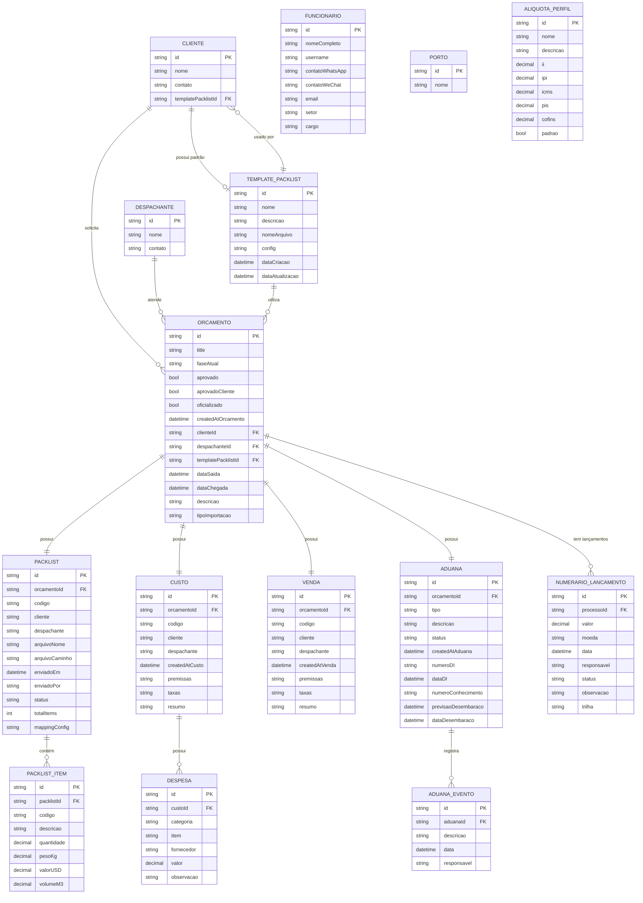

# Diagrama de Entidade-Relacionamento - Orçamento

**Versão:** 1.0  
**Data:** 26 de Março de 2026  
**Tipo:** Documentação Técnica - Modelo de Dados

---

## Visão Geral

Este diagrama representa o modelo de dados da entidade **Orçamento** e todos os seus relacionamentos com outras entidades do sistema de custos de importação.

---

## Diagrama ER

---

## Descrição das Entidades

### Entidade Central: ORCAMENTO
Representa um orçamento de importação com todas as suas fases (Orçamento → Aduana).

**Relacionamentos Principais:**
- Um Cliente pode ter múltiplos Orçamentos (1:N)
- Um Despachante pode atender múltiplos Orçamentos (1:N)
- Um Orçamento possui exatamente um Packlist (1:1)
- Um Orçamento possui exatamente um Custo (1:1)
- Um Orçamento possui exatamente uma Venda (1:1)
- Um Orçamento possui exatamente uma Aduana (1:1)
- Um Orçamento pode ter múltiplos Lançamentos de Numerário (1:N)

### Entidades Relacionadas

#### CLIENTE
Empresa ou pessoa que solicita o orçamento de importação.

#### DESPACHANTE
Despachante aduaneiro responsável pelo processo.

#### TEMPLATE_PACKLIST
Template de configuração para importação de arquivos packlist do cliente.

#### PACKLIST
Lista de embalagem com todos os itens a serem importados.

#### PACKLIST_ITEM
Item individual do packlist (produto, quantidade, peso, valor).

#### CUSTO
Cálculo de custos de importação (impostos, taxas, despesas).

#### DESPESA
Despesa individual associada ao custo (frete, armazenagem, etc.).

#### VENDA
Precificação de venda baseada nos custos calculados.

#### ADUANA
Processo de desembaraço aduaneiro.

#### ADUANA_EVENTO
Eventos e marcos do processo aduaneiro.

#### NUMERARIO_LANCAMENTO
Lançamentos financeiros associados ao orçamento.

---

## Cardinalidade

- `||--||` - Relação um para um (obrigatória)
- `||--o|` - Relação um para um (opcional)
- `||--o{` - Relação um para muitos (opcional)
- `||--|{` - Relação um para muitos (obrigatória)

---

## Como Visualizar

1. **GitHub/GitLab:** Os arquivos .md com Mermaid são renderizados automaticamente
2. **VS Code:** Instale a extensão "Markdown Preview Mermaid Support"
3. **Navegador:** Use o arquivo HTML gerado (DIAGRAMA_ER_ORCAMENTO.html)
4. **Export:** Use ferramentas como Mermaid Live Editor (https://mermaid.live) para exportar como PNG/SVG

---

## Como Exportar como Imagem

### Opção 1: Mermaid Live Editor
1. Acesse https://mermaid.live
2. Cole o código Mermaid acima
3. Clique em "Download PNG" ou "Download SVG"

### Opção 2: VS Code
1. Instale a extensão "Markdown Preview Mermaid Support"
2. Abra este arquivo no VS Code
3. Pressione Ctrl+Shift+V para preview
4. Clique com botão direito no diagrama → "Copy Image" ou tire screenshot

### Opção 3: Arquivo HTML
1. Abra o arquivo `DIAGRAMA_ER_ORCAMENTO.html` no navegador
2. Clique com botão direito no diagrama
3. "Salvar imagem como..." ou tire screenshot

---

## Notas Técnicas

- **PK:** Primary Key (Chave Primária)
- **FK:** Foreign Key (Chave Estrangeira)
- Todas as entidades herdam de `BaseEntity` (id, createdAt, updatedAt)
- Relacionamentos são gerenciados via Entity Framework Core
- IDs são do tipo string (UUID/GUID)
