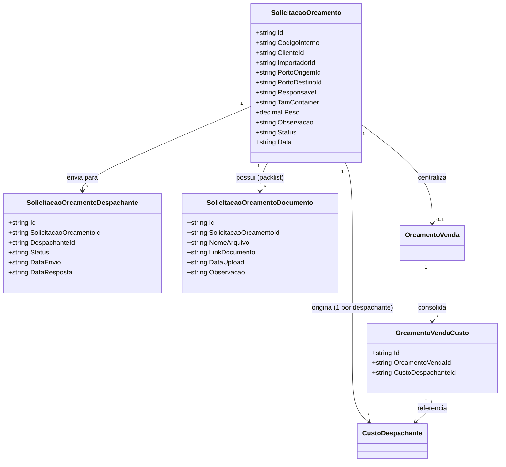

# Plano de Construção — Sistema Aduana V2

**Versão:** 2.4  
**Data:** 09 de Abril de 2026  
**Autor:** Equipe de Desenvolvimento  
**Status:** Em Execução — Revisão de relacionamentos v2.4

---

## 📋 Índice

1. [Decisão e Visão Geral](#1-decisão-e-visão-geral)
2. [Análise Comparativa](#2-análise-comparativa)
3. [Entidades do Novo Sistema](#3-entidades-do-novo-sistema)
4. [Estratégia: V2 do Zero](#4-estratégia-v2-do-zero)
5. [Plano de Implementação por Etapas](#5-plano-de-implementação-por-etapas)
6. [Roadmap de Execução](#6-roadmap-de-execução)
7. [Glossário de Termos](#7-glossário-de-termos)
8. [Revisão da Implementação — Notas Técnicas e Divergências](#8-revisão-da-implementação--notas-técnicas-e-divergências)
9. [Nova Entidade: SolicitacaoOrcamento](#9-nova-entidade-solicitacaoorcamento)

---

## 1. Decisão e Visão Geral

### 1.1 Decisão

O sistema atual (V1) ficará **congelado** e acessível apenas em `/legacy` como referência visual. Não há mais desenvolvimento na V1.

O novo sistema (V2) é construído **do zero** sob a pasta `import-costs/src/app/v2/`, sem feature flags, sem adapters, sem código de compatibilidade.

### 1.2 O que será Reaproveitado do V1

| Reaproveitado | Não Reaproveitado |
|---|---|
| Estrutura do Shell (wrapper + sidebar + header) | Models / Interfaces |
| CSS variables de tema (cores, tipografia) | Services / Repositories |
| Classes de grid e layout do `styles.scss` global | Lógica de negócio |
| Sistema de autenticação / guards | Componentes de tela |
| Helper de localStorage (padrão de leitura/escrita) | Rotas |

### 1.3 Objetivo do Novo Modelo

Sair de um modelo **"orçamento-centric"** para um modelo **"processo-centric"**, com a **Solicitação como processo maior** que agrega e origina tudo:

```
SolicitacaoOrcamento  ←  PROCESSO RAIZ
├── N × SolicitacaoOrcamentoDespachante
│       └── cada um origina 1 CustoDespachante (custo do despachante)
│               └── status: Rascunho → Finalizado
│               └── CustoDespachanteLi / Despesas / NCM / Impostos
├── N × SolicitacaoOrcamentoDocumento  (packlist, proforma, etc.)
└── 1 × OrcamentoVenda  (proposta comercial — pertence à solicitação)
        ├── N × OrcamentoVendaCusto  (junction: consolida N custos)
        └── 1 × EmbarqueAduana  (operação logística)
```

Separação clara de responsabilidades:

- **Solicitação** — `SolicitacaoOrcamento` (⭐ PROCESSO RAIZ — registra a demanda de cotação, distribui para N despachantes e centraliza documentos e a proposta final)
- **Custo Interno** — `CustoDespachante` (cálculo técnico do despachante, originado por uma solicitação; status: `Rascunho` → `Finalizado`)
- **Orçamento de Venda** — `OrcamentoVenda` (proposta comercial ao cliente, **pertence à solicitação** e consolida N custos de despachantes via junction)
- **Processo de Embarque** — `EmbarqueAduana` (operação logística vinculada ao orçamento de venda)

### 1.4 Benefícios

- Separação entre custo e venda permite múltiplos orçamentos por custo
- Status de embarque com histórico auditável
- Free time e pagamentos estruturados por processo
- NCM com cálculo de impostos individualizado
- Cadastros normalizados (portos separados por tipo, importador, exportador, etc.)

---

## 2. Análise Comparativa

### 2.1 Estrutura Atual vs. Nova

| Aspecto | V1 (Legacy) | V2 (Novo) |
|---|---|---|
| **Entidade Central** | `Orcamento` (único) | `CustoDespachante` → `OrcamentoVenda` → `EmbarqueAduana` |
| **Cadastros Base** | 5 entidades | 13+ entidades |
| **Rastreamento** | Histórico simples | Status + Histórico + Free Time |
| **Financeiro** | Campos fixos em Venda | `PagamentoProcesso` (N pagamentos) |
| **Logística** | Porto como string | `ControleNavio` + `ControleNavioTrajeto` |
| **Usuários** | role + permissions | `Cargo` + `NivelAcesso` |
| **Documentos** | Não há | Sistema genérico de anexos |
| **Impostos** | Alíquota global | NCM + alíquotas individualizadas |

### 2.2 Estrutura de Entidades V1 (Congelada)

```
V1 (Legacy):
├── USER
├── CLIENTE
├── DESPACHANTE
├── PORTO
├── ALIQUOTA_PERFIL
├── TEMPLATE_PACKLIST
└── ORCAMENTO
    ├── PACKLIST (1:1)
    │   └── PACKLIST_ITEM (1:N)
    ├── CUSTO (1:1)
    │   └── DESPESA (1:N)
    ├── VENDA (1:1)
    ├── ADUANA (1:1)
    │   └── ADUANA_EVENTO (1:N)
    ├── NUMERARIO_LANCAMENTO (1:N)
    └── FECHAMENTO (1:1)
```

---

## 3. Entidades do Novo Sistema

```
V2 — Árvore de entidades (hierarquia de negócio)

SolicitacaoOrcamento  ← PROCESSO RAIZ (processo maior)
├── SolicitacaoOrcamentoDespachante  (1 por despachante consultado)
│       └── origina 1 × CustoDespachante  (status: Rascunho → Finalizado)
│               ├── CustoDespachanteLi
│               ├── CustoDespachanteDespesa
│               ├── NcmVinculadoOrcamento
│               └── ValorImposto
├── SolicitacaoOrcamentoDocumento    (packlist, proforma, etc.)
└── OrcamentoVenda                   (proposta comercial — pertence à solicitação)
        ├── OrcamentoVendaCusto  (junction N:N com CustoDespachante)
        ├── OrcamentoVendaDespesa
        ├── OrcamentoVendaDespesaExtra
        └── EmbarqueAduana
                ├── HistoricoStatusEmbarque
                ├── FreeTimeEmbarque
                └── PagamentoProcesso

─── Entidades de suporte ───────────────────────────────────────
├── 1. SEGURANÇA
│   ├── Cargo
│   ├── NivelAcesso
│   └── Usuario (auth)
│
├── 2. CADASTROS BASE
│   ├── Cliente
│   ├── Importador
│   ├── Despachante
│   ├── Exportador
│   ├── AgenteCarga
│   ├── CadastroFabricante
│   ├── PortoOrigem
│   ├── PortoDestino
│   ├── Ncm
│   └── ListaPrecoLcl
│
├── 3. CONTROLE LOGÍSTICO
│   ├── ControleNavio
│   └── ControleNavioTrajeto
│
├── 4. ADUANA / STATUS
│   └── StatusEmbarque        (seed de sistema — 7 status fixos)
│
└── 5. DOCUMENTOS
    ├── TipoDocumento
    ├── Documento
    └── DocumentoVinculo
```

---

## 4. Estratégia: V2 do Zero

### 4.1 Estrutura de Pastas

Toda a V2 vive em:

```
import-costs/src/app/v2/
├── core/
│   ├── layout/
│   │   └── shell-v2.component.ts       ← Novo shell com menu V2
│   └── helpers/
│       └── storage-v2.helper.ts        ← localStorage com prefixo v2_
└── features/
    ├── dashboard/
    ├── cadastros/
    │   ├── portos/
    │   ├── clientes/
    │   ├── importadores/
    │   ├── exportadores/
    │   ├── agentes-carga/
    │   ├── fabricantes/
    │   ├── ncm/
    │   ├── lista-preco-lcl/
    │   ├── despachantes/
    │   ├── cargos/
    │   └── niveis-acesso/
    ├── controle-navio/
    ├── solicitacao-orcamento/
    ├── custo-despachante/
    ├── orcamento-venda/
    ├── embarque-aduana/
    └── documentos/
```

### 4.2 Rotas

```typescript
// app.routes.ts — estrutura após Etapa 0

export const routes: Routes = [
  { path: 'login', ... },

  // V1 — congelada, somente referência visual
  {
    path: 'legacy',
    component: ShellComponent,       // shell V1 original
    canActivate: [authGuard],
    children: [
      // ← todas as rotas atuais ficam aqui sem alteração
      { path: 'processos', ... },
      { path: 'aliquotas', ... },
      // ...demais
    ]
  },

  // V2 — sistema novo
  {
    path: '',
    component: ShellV2Component,
    canActivate: [authGuard],
    children: [
      { path: '', redirectTo: 'dashboard', pathMatch: 'full' },
      { path: 'dashboard', loadComponent: () => import('./v2/features/dashboard/...') },
      // novas rotas adicionadas a cada etapa
    ]
  },

  { path: '**', redirectTo: '' }
];
```

### 4.3 localStorage sem Colisão

Todos os dados V2 usam prefixo `v2_`:

```typescript
// storage-v2.helper.ts
export const keysV2 = {
  // Cadastros
  portosOrigem:       'v2_portos_origem',
  portosDestino:      'v2_portos_destino',
  clientes:           'v2_clientes',
  importadores:       'v2_importadores',
  exportadores:       'v2_exportadores',
  agentesCarga:       'v2_agentes_carga',
  fabricantes:        'v2_fabricantes',
  ncms:               'v2_ncms',
  listaPrecoLcl:      'v2_lista_preco_lcl',
  despachantes:       'v2_despachantes',
  cargos:             'v2_cargos',
  niveisAcesso:       'v2_niveis_acesso',
  // Logística
  controleNavios:     'v2_controle_navios',
  navioTrajetos:      'v2_navio_trajetos',
  // Core
  custos:             'v2_custos_despachante',
  custosLi:           'v2_custos_li',
  custosDespesas:     'v2_custos_despesas',
  ncmsVinculados:     'v2_ncms_vinculados',
  valoresImposto:     'v2_valores_imposto',
  // Comercial
  orcamentosVenda:    'v2_orcamentos_venda',
  orcDespesas:        'v2_orc_despesas',
  orcExtras:          'v2_orc_extras',
  orcCustos:          'v2_orc_custos',           // OrcamentoVendaCusto (junction)
  // Solicitação de Orçamento
  solicitacoes:             'v2_solicitacoes_orcamento',
  solicitacaoDespachantes:  'v2_solicitacao_despachantes',
  solicitacaoDocumentos:    'v2_solicitacao_documentos',
  // Operação
  embarques:          'v2_embarques',
  statusEmbarque:     'v2_status_embarque',
  historicoStatus:    'v2_historico_status',
  freeTimes:          'v2_free_times',
  pagamentos:         'v2_pagamentos',
  // Documentos
  tiposDocumento:     'v2_tipos_documento',
  documentos:         'v2_documentos',
  documentoVinculos:  'v2_documento_vinculos',
};
```

### 4.4 Padrão de Desenvolvimento por Feature

Cada feature segue o mesmo padrão:

```
features/<nome>/
├── models/
│   └── <nome>.models.ts
├── services/
│   └── <nome>.service.ts
├── repositories/
│   └── <nome>.repository.ts
├── components/
│   ├── <nome>-list.component.ts
│   └── <nome>-form.component.ts
└── pages/
    └── <nome>.component.ts      (container da rota)
```

---

## 5. Plano de Implementação por Etapas

---

### ⚡ ETAPA 0: Base — Shell, Layout e Roteamento
**Duração:** 2-3 dias  
**Status:** IMEDIATO — Primeira coisa a fazer  
**Objetivo:** Ter o esqueleto V2 rodando: rotas, shell com menu, dashboard placeholder

#### 0.1 Criar Estrutura de Pastas

```
import-costs/src/app/v2/
├── core/
│   ├── layout/
│   └── helpers/
└── features/
    └── dashboard/
```

#### 0.2 Criar `shell-v2.component.ts`

Inspirado no `ShellComponent` V1 mas com o menu V2.

**Menu lateral da V2:**

| Grupo | Itens |
|---|---|
| **Principal** | Dashboard |
| **Operação** | Solicitações, Custos (Despachante), Orçamentos de Venda, Embarques |
| **Logística** | Controle de Navios |
| **Cadastros** | Portos Origem, Portos Destino, Clientes, Importadores, Exportadores, Agentes de Carga, Fabricantes, NCM, Lista Preço LCL, Despachantes |
| **Administração** | Cargos, Níveis de Acesso |
| **Referência** | 🔗 Acessar Versão Legada (`/legacy`) |

#### 0.3 Criar `storage-v2.helper.ts`

Arquivo com o objeto `keysV2` contendo todas as chaves localStorage prefixadas com `v2_` (conforme seção 4.3).

#### 0.4 Criar Dashboard Placeholder

`v2/features/dashboard/dashboard.component.ts` exibindo:
- Título "Sistema em construção"
- 3 cards de contadores zerados (Embarques Ativos, Orçamentos Pendentes, Custos do Mês)
- Link "Acessar Versão Legada →" apontando para `/legacy`

#### 0.5 Atualizar `app.routes.ts`

- Mover todas as rotas atuais para baixo de `path: 'legacy'` com o `ShellComponent` V1.
- Criar novo bloco `path: ''` com `ShellV2Component` e filho `dashboard`.

#### 0.6 Checklist da Etapa 0

- [ ] Pasta `v2/` criada com estrutura core + features/dashboard
- [ ] `ShellV2Component` criado com menu completo da V2
- [ ] `storage-v2.helper.ts` criado com todas as chaves
- [ ] `DashboardV2Component` placeholder criado
- [ ] `app.routes.ts` atualizado: V1 em `/legacy`, V2 em `/`
- [ ] Aplicação abre em `/` mostrando novo shell V2
- [ ] Link `/legacy` leva ao sistema V1 intacto
- [ ] Sem erros de compilação

---

### 📦 ETAPA 1: Cadastros Bloco 1 — Portos, Clientes, Importadores, Despachantes
**Duração:** 1 semana  
**Objetivo:** Primeiros cadastros operacionais necessários para CustoDespachante

#### Entidades desta etapa

| Entidade | Campos principais |
|---|---|
| `PortoOrigem` | id, nome, codigo, pais, ativo |
| `PortoDestino` | id, nome, codigo, estado?, pais, ativo |
| `Cliente` | id, razaoSocial, cnpj, email, telefone, ativo |
| `Importador` | id, razaoSocial, cnpj, email, telefone, ativo |
| `Despachante` | id, nome, crn, email, telefone, ativo |

#### Features a criar

Para cada entidade acima, criar:

```
v2/features/cadastros/<entidade>/
├── models/<entidade>.models.ts
├── services/<entidade>.service.ts
├── repositories/<entidade>.repository.ts
├── components/
│   ├── <entidade>-list.component.ts    (tabela + busca + botão novo)
│   └── <entidade>-form.component.ts    (form em dialog/modal)
└── pages/<entidade>.component.ts
```

Adicionar rota em `app.routes.ts` (bloco V2).  
Adicionar link no menu do `ShellV2Component`.

#### Checklist da Etapa 1

- [x] PortoOrigem: CRUD completo
- [x] PortoDestino: CRUD completo
- [x] Cliente: CRUD completo
- [x] Importador: CRUD completo
- [x] Despachante: CRUD completo
- [x] Todos cadastros acessíveis pelo menu
- [x] Dados persistem no localStorage com prefixo `v2_`
- [x] Validações de campos obrigatórios

---

### 📦 ETAPA 2: Cadastros Bloco 2 — Exportador, AgenteCarga, Fabricante, NCM, ListaPrecoLcl
**Duração:** 1 semana  
**Objetivo:** Completar cadastros necessários para os fluxos de custo e embarque

#### Entidades desta etapa

| Entidade | Campos principais |
|---|---|
| `Exportador` | id, nome, documento, pais, cidade, ativo |
| `AgenteCarga` | id, nome, documento, pais, contato, ativo |
| `CadastroFabricante` | id, nome, pais, cidade, contato, ativo |
| `Ncm` | id, codigoNcm (8 dígitos), descricao, aliqII, aliqIPI, aliqPIS, aliqCOFINS, aliqICMS, ativo |
| `ListaPrecoLcl` | id, categoria, descricao, nomeChines?, precoUsdPorCbm, precoUsdPorKg, dataVigencia, ativo |

#### Destaques de validação

- `Ncm.codigoNcm`: exatamente 8 dígitos numéricos
- `Ncm` alíquotas: entre 0 e 100
- NCM deve ter busca por código ou descrição (componente `NcmSelectorComponent` reutilizável)

#### Checklist da Etapa 2

- [x] Exportador: CRUD completo
- [x] AgenteCarga: CRUD completo
- [x] CadastroFabricante: CRUD completo
- [x] Ncm: CRUD + validação de 8 dígitos
- [x] ListaPrecoLcl: CRUD completo
- [ ] `NcmSelectorComponent` criado (busca + seleção) ⚠️ *Pendente — implementação inline no wizard substituiu o componente reutilizável*
- [x] Todos acessíveis pelo menu

---

### 📦 ETAPA 3: Segurança — Cargo e NivelAcesso
**Duração:** 3 dias  
**Objetivo:** Implementar entidades de organização de usuários

#### Entidades desta etapa

| Entidade | Campos principais |
|---|---|
| `Cargo` | id, nome, descricao, ativo |
| `NivelAcesso` | id, nome, ordem, descricao, ativo |

#### Seed data

Ao inicializar o storage V2, verificar se já existem e criar se não:

```typescript
const CARGOS_SEED = [
  { nome: 'Despachante', descricao: 'Operador de despacho aduaneiro' },
  { nome: 'Analista', descricao: 'Analista operacional' },
  { nome: 'Gerente', descricao: 'Gestão de operações' },
  { nome: 'Administrador', descricao: 'Admin do sistema' },
];

const NIVEIS_ACESSO_SEED = [
  { nome: 'Básico', ordem: 1 },
  { nome: 'Operacional', ordem: 2 },
  { nome: 'Supervisor', ordem: 3 },
  { nome: 'Administrador', ordem: 4 },
];
```

#### Checklist da Etapa 3

- [x] Cargo: CRUD completo
- [x] NivelAcesso: CRUD completo
- [x] Seed data criado na inicialização da V2
- [x] Acessíveis pelo menu em "Administração"

---

### 📦 ETAPA 4: Controle Logístico — ControleNavio e Trajetórias
**Duração:** 4 dias  
**Objetivo:** Rastrear navios e suas viagens com múltiplas trajetórias

#### Modelo de Dados

```typescript
export interface ControleNavio {
  id: string;
  numeroViagem: string;
  nomeNavio: string;
  observacao?: string;
  ativo: boolean;
}

export interface ControleNavioTrajeto {
  id: string;
  controleNavioId: string;
  portoOrigemId: string;       // FK PortoOrigem
  portoDestinoId: string;      // FK PortoDestino
  etd: string;                 // ISO 8601 — Estimated Time of Departure ⚠️ documentado como Date, implementado como string
  eta: string;                 // ISO 8601 — Estimated Time of Arrival
  trajetoDescricao?: string;
}
```

#### Interface do Formulário

O formulário do navio inclui uma seção inline para adicionar/remover trajetórias:

```
┌─────────────────────────────────────────┐
│  Cadastro de Navio                      │
├─────────────────────────────────────────┤
│  Número da Viagem: [__________]         │
│  Nome do Navio:    [__________]         │
│  Observação:       [__________]         │
│                                         │
│  ┌─ Trajetórias ──────────────────────┐ │
│  │  Porto Origem   [▼ Santos]         │ │
│  │  Porto Destino  [▼ Shanghai]       │ │
│  │  ETD            [01/04/2026]       │ │
│  │  ETA            [25/04/2026]       │ │
│  │  Descrição      [_________]        │ │
│  │                                    │ │
│  │  [+ Adicionar Trajetória]          │ │
│  │                                    │ │
│  │  1. Santos → Shanghai  (24 dias)   │ │
│  │  2. Shanghai → Ningbo  (2 dias)    │ │
│  └────────────────────────────────────┘ │
│  [Salvar]  [Cancelar]                   │
└─────────────────────────────────────────┘
```

#### Checklist da Etapa 4

- [x] ControleNavio: CRUD com trajetórias inline
- [x] ControleNavioTrajeto: adição/remoção inline no form do navio
- [x] Validação: ETA >= ETD
- [x] Cálculo automático de duração da viagem (dias)
- [x] Listagem com trajetórias expansíveis por navio
- [x] Filtro por nº viagem e nome do navio

---

### 📦 ETAPA 5: CustoDespachante (Custo Interno)
**Duração:** 5-7 dias  
**Objetivo:** Implementar o cálculo de custo interno, base para os orçamentos

#### Modelo de Dados

```typescript
export type StatusCustoDespachante = 'Rascunho' | 'Finalizado'; // ⭐ v2.4

export interface CustoDespachante {
  id: string;
  codigoInterno: string;          // gerado: CD-AAAA-NNN
  despachanteId: string;
  importadorId: string;
  portoOrigemId: string;
  portoDestinoId: string;
  responsavel: string;            // ⚠️ plano usava usuarioResponsavelId (FK), implementado como texto livre
  peso: number;
  fobUsd: number;
  fobReais: number;
  cifUsd: number;
  cifReais: number;
  seguroUsd: number;
  taxaUsd: number;
  taxaUsdAgente?: number;
  tamContainer: string;           // '20' | '40' | 'LCL'
  data: string;                  // ISO 8601 ⚠️ documentado como Date
  observacao?: string;
  solicitacaoOrcamentoId?: string; // FK — pré-preenchido ao vir de uma solicitação
  status: StatusCustoDespachante; // ⭐ v2.4 — Rascunho (em elaboração) | Finalizado (pronto para OV)
}

export interface CustoDespachanteLi {
  id: string;
  custoDespachanteId: string;
  ncm: string;
  descricao: string;
  valor: number;
  data: string;                   // ISO 8601
}

export interface CustoDespachanteDespesa {
  id: string;
  custoDespachanteId: string;
  descricao: string;
  valor: number;
  data: Date;
  entraBaseIcms: boolean;
}

export interface NcmVinculadoOrcamento {
  id: string;
  custoDespachanteId: string;
  ncmId: string;
  numeroNcm: string;
  descricao: string;
  aliIpi: number;
  aliIi: number;
  aliPis: number;
  aliCofins: number;
  aliIcms: number;
  baseCalculo: number;
}

export interface ValorImposto {
  id: string;
  ncmVinculadoOrcamentoId: string;
  aliIi: number; valorIi: number;
  aliIpi: number; valorIpi: number;
  aliPis: number; valorPis: number;
  aliCofins: number; valorCofins: number;
  aliIcms: number; valorIcms: number;
  totalImpostos: number;
}
```

#### Wizard de Criação (5 Passos)

```
●──────○──────○──────○──────○
Dados   LI    Despesas  NCM   Resumo
Básicos
```

- **Passo 1 — Dados Básicos:** importador, despachante, portos, responsável, pesos, FOB/CIF, container
- **Passo 2 — LI:** lista de itens com NCM livre, descrição, valor
- **Passo 3 — Despesas:** despesas do despachante com flag "Entra base ICMS"
- **Passo 4 — NCM/Impostos:** vincular NCMs cadastrados, sistema calcula impostos
- **Passo 5 — Resumo:** visão geral, totais, confirmação

#### Engine de Cálculo de Impostos

```typescript
// ImpostoCalculatorService
calcularImpostos(ncmVinculado: NcmVinculadoOrcamento): ValorImposto {
  const base = ncmVinculado.baseCalculo;
  const valorIi = base * (ncmVinculado.aliIi / 100);
  const valorIpi = (base + valorIi) * (ncmVinculado.aliIpi / 100);
  const valorPis = base * (ncmVinculado.aliPis / 100);
  const valorCofins = base * (ncmVinculado.aliCofins / 100);
  const valorIcms = (base + valorIi + valorIpi) * (ncmVinculado.aliIcms / 100);
  return { /* ... valores calculados ... */ };
}
```

#### Código Interno

Formato: `CD-2026-001` (CD = prefixo, ano, número sequencial 3 dígitos)

#### Checklist da Etapa 5

- [x] Todos os models criados (CustoDespachante, LI, Despesa, NcmVinculado, ValorImposto)
- [x] Wizard funcional com 5 passos
- [x] `ImpostoCalculatorService` implementado
- [x] Listagem com filtro por código, despachante e importador
- [x] Edição de custo existente
- [x] Geração automática do código interno (CD-AAAA-NNN)
- [x] NCM selecionado inline no passo 4 com pré-preenchimento de alíquotas

---

### 📦 ETAPA 6: OrcamentoVenda (Proposta Comercial)
**Duração:** 1 semana  
**Objetivo:** Gerar orçamento de venda baseado em CustoDespachante

#### Modelo de Dados

```typescript
export interface OrcamentoVenda {
  id: string;
  codigoInterno: string;          // OV-AAAA-NNN
  clienteId: string;
  solicitacaoOrcamentoId?: string; // ⭐ v2.4 — FK à solicitação de origem
  custoDespachanteId?: string;    // mantido como opcional (retrocompatibilidade com dados antigos)
  data: Date;
  tamContainer: string;
  pesoBruto: number;
  pesoLiquido: number;
  freteInternacional: number;
  cifReais: number; cifUsd: number;
  fobReais: number; fobUsd: number;
  taxaUsd: number;
  honorarios: number;
  totalImpostos: number;
  totalDespesas: number;
  totalExtras: number;
  totalGeral: number;
  observacao?: string;
}

export interface OrcamentoVendaDespesa {
  id: string;
  orcamentoVendaId: string;
  descricao: string;
  valor: number;
}

export interface OrcamentoVendaDespesaExtra {
  id: string;
  orcamentoVendaId: string;
  descricao: string;
  valor: number;
}
```

#### Fluxo de Criação

1. Usuário seleciona um `CustoDespachante` (seletor com busca)
2. Sistema pré-preenche campos a partir do custo selecionado
3. Usuário define: cliente, honorários, despesas adicionais, extras
4. System calcula `totalGeral = custos + impostos + despesas + extras + honorarios + frete`
5. `OrcamentoPreviewComponent` gera visualização formatada para o cliente

#### Código Interno

Formato: `OV-2026-001`

#### Checklist da Etapa 6

- [x] CRUD de OrcamentoVenda completo
- [x] Seletor de CustoDespachante base (com busca por código/despachante)
- [x] Cálculo automático de total geral
- [x] Preview de orçamento para o cliente (modal com resumo completo)
- [x] Listagem com filtros (código, cliente, custo base)
- [x] Código automático `OV-AAAA-NNN`

---

### 📦 ETAPA 7: EmbarqueAduana (Processo Operacional)
**Duração:** 1,5-2 semanas  
**Objetivo:** Gerenciar o processo de embarque com timeline de status, free time e pagamentos

#### Modelo de Dados

```typescript
export type StatusEmbarqueNome =
  | 'Previsto' | 'Aguardando' | 'Atracado'
  | 'Registrado' | 'Desembaraçado' | 'Entregue' | 'Finalizado';

export interface StatusEmbarque {
  id: string;
  nome: StatusEmbarqueNome;
  codigo: string;    // 'PREV', 'AGRD', etc.
  ordem: number;
  ativo: boolean;
}

export interface EmbarqueAduana {
  id: string;
  codigoInterno: string;        // EMB-AAAA-NNN
  refOminium: string;
  portoOrigemId: string;
  portoDestinoId: string;
  agenteCargaId: string;
  clienteId: string;
  usuarioResponsavelId: string;
  controleNavioId: string;
  despachanteId: string;
  exportadorId?: string;
  statusEmbarqueId: string;     // status ATUAL
  custoDespachanteId: string;
  orcamentoVendaId: string;
  imp: string;
  bl: string;
  container: string;
  kg: number;
  etd: Date; eta: Date;
  avisoPrevisao?: Date;
  avisoChegada?: Date;
  dataRegistro?: Date;
  desemb?: Date;
  entrega?: Date;
  li: string;
  registro?: string;
  refAg?: string;
  observacao?: string;
}

export interface HistoricoStatusEmbarque {
  id: string;
  embarqueAduanaId: string;
  statusEmbarqueId: string;
  dataStatus: Date;
  observacao?: string;
  usuarioId: string;
}

export interface FreeTimeEmbarque {
  id: string;
  embarqueAduanaId: string;
  quantidadeDias: number;
  dataInicio: Date;
  dataFim: Date;            // dataInicio + quantidadeDias
  observacao?: string;
}

export interface PagamentoProcesso {
  id: string;
  embarqueAduanaId: string;
  tipoPagamento: 'CobrancaSinal' | 'SinalPago' | 'FechamentoPago' | 'Honorario' | 'Outro';
  dataPrevista: Date;
  dataPagamento?: Date;     // preenchido quando efetivado
  valor: number;
  despachanteId: string;
  observacao?: string;
}
```

#### Seed de Status (criado na inicialização V2)

```typescript
const STATUS_EMBARQUE_SEED = [
  { nome: 'Previsto',        codigo: 'PREV', ordem: 1 },
  { nome: 'Aguardando',      codigo: 'AGRD', ordem: 2 },
  { nome: 'Atracado',        codigo: 'ATRC', ordem: 3 },
  { nome: 'Registrado',      codigo: 'RGTD', ordem: 4 },
  { nome: 'Desembaraçado',   codigo: 'DSMB', ordem: 5 },
  { nome: 'Entregue',        codigo: 'ENTG', ordem: 6 },
  { nome: 'Finalizado',      codigo: 'FNLZ', ordem: 7 },
];
```

#### Visão Detalhada do Embarque

A tela de detalhe mostra seções colapsáveis:
1. Informações Gerais (dados básicos, referências)
2. Logística (navio, portos, ETD/ETA)
3. Status com Timeline visual: `●━━━●━━━●━━━○━━━○━━━○━━━○`
4. Free Time com alerta de vencimento (badge vermelho se <= 3 dias)
5. Pagamentos (tabela com tipo, datas, valor, status pago/pendente)
6. Histórico de Status (feed cronológico de alterações)

#### Lógica de Alteração de Status

Ao alterar status:
1. Atualizar `embarque.statusEmbarqueId`
2. Criar `HistoricoStatusEmbarque` automaticamente com data, usuário, observação

#### Checklist da Etapa 7

- [x] Seed de StatusEmbarque na inicialização V2
- [x] CRUD de EmbarqueAduana
- [x] Tela de detalhe completa com todas as seções
- [x] Modal de alteração de status com criação automática de histórico
- [x] Timeline visual de status inline no detalhe
- [x] CRUD de FreeTimeEmbarque com alerta de vencimento (≤ 3 dias)
- [x] CRUD de PagamentoProcesso com resumo financeiro (pago/pendente/vencido)
- [x] Listagem com filtros (status, cliente, busca geral)
- [x] Código automático `EMB-AAAA-NNN`

---

### 📦 ETAPA 8: Sistema de Documentos
**Duração:** 4-5 dias  
**Objetivo:** Permitir anexar documentos a qualquer entidade do sistema

#### Modelo de Dados

```typescript
export interface TipoDocumento {
  id: string;
  nome: string;
  codigo: string;          // 'BL', 'INVOICE', 'PACKLIST', etc.
  categoria: 'Embarque' | 'Fiscal' | 'Aduana' | 'Contrato' | 'Outro';
  ativo: boolean;
}

export interface Documento {
  id: string;
  tipoDocumentoId: string;
  usuarioUploadId: string;
  nomeOriginal: string;
  nomeSalvo: string;
  caminhoArquivo: string;  // base64 no localStorage
  extensao: string;
  contentType: string;
  tamanhoBytes: number;
  dataUpload: Date;
  observacao?: string;
}

export interface DocumentoVinculo {
  id: string;
  documentoId: string;
  entidade: string;        // 'EmbarqueAduana', 'OrcamentoVenda', etc.
  entidadeId: string;
  papel?: string;
  dataVinculo: Date;
}
```

#### Seed de Tipos de Documento

```typescript
const TIPOS_DOCUMENTO_SEED = [
  { nome: 'Bill of Lading',              codigo: 'BL',       categoria: 'Embarque' },
  { nome: 'Invoice',                     codigo: 'INVOICE',  categoria: 'Fiscal' },
  { nome: 'Packing List',               codigo: 'PACKLIST', categoria: 'Embarque' },
  { nome: 'DI - Declaração de Importação', codigo: 'DI',    categoria: 'Aduana' },
  { nome: 'LI - Licença de Importação', codigo: 'LI',       categoria: 'Aduana' },
  { nome: 'Certificado de Origem',       codigo: 'CO',       categoria: 'Fiscal' },
  { nome: 'Comprovante de Pagamento',    codigo: 'PGTO',     categoria: 'Fiscal' },
  { nome: 'Contrato',                    codigo: 'CONTRATO', categoria: 'Contrato' },
  { nome: 'Outros',                      codigo: 'OUTROS',   categoria: 'Outro' },
];
```

#### Componente Reutilizável

`DocumentoAnexoComponent` — widget que pode ser inserido em qualquer tela com:

```html
<app-documento-anexo
  [entidade]="'EmbarqueAduana'"
  [entidadeId]="embarque.id">
</app-documento-anexo>
```

Renderiza: lista de documentos vinculados + botão "Anexar Novo" com upload drag-and-drop.

#### Nota sobre Armazenamento

Arquivos são convertidos para Base64 e armazenados no localStorage (~5-10 MB de limite). Para produção com API, migrar para Azure Blob Storage.

#### Checklist da Etapa 8

- [x] Seed de TipoDocumento
- [x] Upload de arquivo com conversão para Base64
- [x] Vinculação de documentos a entidades
- [x] `DocumentoAnexoComponent` reutilizável
- [x] Preview de PDF e imagens
- [x] Download de documentos
- [x] Remoção com confirmação

---

### 📦 ETAPA 9: Dashboard Real com KPIs
**Duração:** 3-4 dias  
**Objetivo:** Substituir o placeholder por um dashboard funcional

#### KPIs e Widgets

| Widget | Dados |
|---|---|
| Embarques Ativos | Count de embarques em status != Finalizado |
| Orçamentos Pendentes | Count de OrcamentoVenda sem embarque vinculado |
| Custos do Mês | Count de CustoDespachante criados no mês corrente |
| Free Times Vencendo | Embarques com dataFim do FreeTime <= 7 dias |
| Embarques por Status | Gráfico de barras ou pizza |
| Próximos ETAs | Lista dos 5 embarques com ETA mais próximo |
| Pagamentos Pendentes | Pagamentos com dataPrevista passada e sem dataPagamento |

#### Checklist da Etapa 9

- [x] Substituir dashboard placeholder por dashboard real
- [x] Todos os KPIs calculados a partir do localStorage V2
- [x] Gráfico de embarques por status
- [x] Lista de próximos ETAs
- [x] Lista de free times vencendo (com alerta visual)
- [x] Pagamentos pendentes em atraso destacados

---

### 📦 ETAPA 10: Seed de Dados para Apresentação do Sistema
**Duração:** 2-3 dias  
**Objetivo:** Criar massa de dados realistas e interligados que demonstrem todos os fluxos do sistema, viabilizando apresentações e demos convincentes

#### Justificativa

Um sistema com todas as telas vazias não demonstra valor em uma apresentação. Esta etapa cria dados coerentes que:
- Ativam todos os KPIs do dashboard simultaneamente
- Demonstram o fluxo completo: Custo → Orçamento → Embarque
- Simulam cenários críticos (free times vencendo, pagamentos atrasados)
- Permitem navegar em todas as telas com dados reais e relacionamentos visíveis

#### Implementação

Criar `SeedDemoService` em `v2/core/helpers/seed-demo.service.ts` com:
- `isDemoCarregado(): boolean` — verifica flag `v2_demo_carregado` no localStorage
- `carregarSeedDemo(): void` — popula todas as entidades em ordem de dependência
- `limparSeedDemo(): void` — remove todos os dados V2 mantendo seeds de sistema (Cargos, NivelAcesso, StatusEmbarque, TipoDocumento)

Adicionar ao `DashboardV2Component`:
- Banner de boas-vindas com botão **"Carregar Dados Demo"** quando `!isDemoCarregado()`
- Botão **"Limpar Demo"** no canto superior direito quando demo estiver carregado

---

#### Entidades Base — Dados a Criar

**Portos de Origem (5 — China)**

| Código | Nome | País |
|---|---|---|
| SHA | Porto de Shanghai | China |
| NGB | Porto de Ningbo | China |
| HKG | Porto de Hong Kong | China |
| TAO | Porto de Qingdao | China |
| GZH | Porto de Guangzhou | China |

**Portos de Destino (5 — Brasil)**

| Código | Nome | Estado | País |
|---|---|---|---|
| BRSSZ | Porto de Santos | SP | Brasil |
| BRPNG | Porto de Paranaguá | PR | Brasil |
| BRITJ | Porto de Itajaí | SC | Brasil |
| BRRJO | Porto do Rio de Janeiro | RJ | Brasil |
| BRPCE | Porto do Pecém | CE | Brasil |

**Exportadores (3 — China)**

| Nome | País | Cidade |
|---|---|---|
| Shanghai Tech Electronics Co. Ltd | China | Shanghai |
| Ningbo Textile Manufacturing Ltd | China | Ningbo |
| Guangdong Auto Parts Co. Ltd | China | Guangzhou |

**Agentes de Carga (3)**

| Nome | País |
|---|---|
| COSCO Shipping Lines | China |
| Mediterranean Shipping Co. (MSC) | Suíça |
| CMA CGM Brasil Logistics | Brasil |

**Fabricantes (3 — China)**

| Nome | País | Cidade |
|---|---|---|
| Shenzhen Consumer Electronics Factory | China | Shenzhen |
| Ningbo Garment & Textile Maker | China | Ningbo |
| Guangzhou Motor Components Ltd | China | Guangzhou |

**Importadores (3 — Brasil)**

| Razão Social | CNPJ |
|---|---|
| TechBrasil Importações Ltda | 12.345.678/0001-90 |
| Têxtil Sul Comércio Exterior Ltda | 23.456.789/0001-01 |
| AutoPeças Nacional Importações Ltda | 34.567.890/0001-12 |

**Clientes (4 — Brasil)**

| Razão Social | CNPJ |
|---|---|
| TechBrasil Importações Ltda | 12.345.678/0001-90 |
| Têxtil Sul Comércio Exterior Ltda | 23.456.789/0001-01 |
| AutoPeças Nacional Importações Ltda | 34.567.890/0001-12 |
| MegaMart Distribuidora Nacional Ltda | 45.678.901/0001-23 |

**Despachantes (2)**

| Nome | CRN |
|---|---|
| Costa & Associados Despachos Aduaneiros | 1234 |
| Logística Brasil Despachos Ltda | 5678 |

**NCMs Cadastrados (5 — códigos reais)**

| Código NCM | Descrição | II% | IPI% | PIS% | COFINS% | ICMS% |
|---|---|---|---|---|---|---|
| 85171400 | Smartphones e aparelhos celulares | 20 | 15 | 2.10 | 9.65 | 18 |
| 84713000 | Laptops e computadores portáteis | 16 | 10 | 2.10 | 9.65 | 18 |
| 61099000 | Camisetas e regatas de malha de algodão | 35 | 0 | 2.10 | 9.65 | 12 |
| 87089900 | Partes e acessórios para veículos automotores | 18 | 5 | 2.10 | 9.65 | 12 |
| 61051000 | Camisas casuais de algodão para homens | 35 | 0 | 2.10 | 9.65 | 12 |

**Lista Preço LCL (3 itens)**

| Categoria | Descrição | USD/CBM | USD/KG |
|---|---|---|---|
| Geral | Carga Geral LCL Shanghai–Santos | 280 | 1.50 |
| Perecível | Carga Refrigerada LCL | 420 | 2.20 |
| Perigosa | IMO / Carga Perigosa LCL | 380 | 1.90 |

---

#### Navios e Viagens (3)

| Navio | Nº Viagem | Trajeto | ETD | ETA |
|---|---|---|---|---|
| MSC Aurora | 2026-001 | Shanghai (SHA) → Santos (BRSSZ) | 01/03/2026 | 05/04/2026 |
| COSCO Harmony | 2026-002 | Ningbo (NGB) → Paranaguá (BRPNG) | 10/03/2026 | 19/04/2026 |
| CMA Brésil | 2026-003 | Shanghai (SHA) → Santos (BRSSZ) | 05/04/2026 | 10/05/2026 |

---

#### Cenários de Negócio (8 cenários — referência: 01/04/2026)

Os 8 cenários cobrem todo o ciclo de vida de uma importação, com embarques em diferentes pontos da linha do tempo:

---

**Cenário 1 — Embarque Finalizado (Histórico de Sucesso)**

> Visualizar um processo encerrado com sucesso, com histórico completo de status e pagamentos quitados.

- **Embarque:** `EMB-2026-001` | **Cliente:** TechBrasil | **Produto:** Smartphones (NCM 85171400)
- **Navio:** MSC Aurora 2026-001 | **Rota:** Shanghai → Santos
- **Status:** ✅ **Finalizado**
- **Timeline:** Previsto(01/03) → Aguardando(20/03) → Atracado(02/03) → Registrado(05/03) → Desembaraçado(12/03) → Entregue(20/03) → Finalizado(25/03)
- **FreeTime:** 14 dias — início 02/03, fim 16/03 (expirado)
- **Pagamentos:** Sinal (quitado 01/03), Fechamento (quitado 22/03), Honorário (quitado 25/03)
- **CustoDespachante:** `CD-2026-001` | **OrcamentoVenda:** `OV-2026-001`

---

**Cenário 2 — Embarque Recém-Entregue (Honorário Pendente)**

> Processo quase encerrado. Produto entregue, mas honorário ainda não pago — aparece em "Pagamentos em Atraso" no dashboard.

- **Embarque:** `EMB-2026-002` | **Cliente:** Têxtil Sul | **Produto:** Camisetas (NCM 61099000)
- **Navio:** COSCO Harmony 2026-002 | **Rota:** Ningbo → Paranaguá
- **Status:** 🟡 **Entregue** | Entregue: 28/03/2026
- **FreeTime:** 14 dias — fim 26/03 (expirado)
- **Pagamentos:** Sinal (quitado), Fechamento (quitado), Honorário **pendente** (dataPrevista 01/04 — **vencido!**)
- **CustoDespachante:** `CD-2026-002` | **OrcamentoVenda:** `OV-2026-002`

---

**Cenário 3 — Em Desembaraço (Aguardando Liberação)**

> DI registrada e aguardando canal da RFB. Free time confortável.

- **Embarque:** `EMB-2026-003` | **Cliente:** AutoPeças Nacional | **Produto:** Autopeças (NCM 87089900)
- **Status:** 🟠 **Desembaraçado** | Desembaraço: 29/03/2026
- **FreeTime:** 21 dias — início 25/03, fim 15/04 (14 dias restantes)
- **Pagamentos:** CobrancaSinal (quitado), Fechamento **pendente** (dataPrevista 10/04)
- **CustoDespachante:** `CD-2026-003` | **OrcamentoVenda:** `OV-2026-003`

---

**Cenário 4 — Free Time Crítico 🔴 (Vence em 1 dia)**

> Alerta vermelho no dashboard — ação urgente necessária para evitar sobreestadia.

- **Embarque:** `EMB-2026-004` | **Cliente:** MegaMart | **Produto:** Laptops (NCM 84713000)
- **Status:** 🔵 **Registrado** | Registro: 20/03/2026
- **FreeTime:** 10 dias — início 23/03, fim **02/04/2026** → **1 dia restante!** 🔴
- **Pagamentos:** CobrancaSinal **pendente** (dataPrevista 28/03 — **em atraso!**)
- **CustoDespachante:** `CD-2026-004` | **OrcamentoVenda:** `OV-2026-004`

---

**Cenário 5 — Free Time com Alerta 🟠 (Vence em 7 dias)**

> Contêiner atracou recentemente. Free time correndo, nível de atenção.

- **Embarque:** `EMB-2026-005` | **Cliente:** TechBrasil | **Produto:** Smartphones (NCM 85171400)
- **Status:** 🟣 **Atracado** | Atracou: 29/03/2026 | ETA: 01/04/2026
- **FreeTime:** 10 dias — início 29/03, fim **08/04/2026** → **7 dias restantes** 🟠
- **Pagamentos:** CobrancaSinal (quitado 01/03), Fechamento **pendente** (dataPrevista 05/04)
- **CustoDespachante:** `CD-2026-005` | **OrcamentoVenda:** `OV-2026-005`

---

**Cenário 6 — Aguardando Chegada (ETA em 7 dias)**

> Navio em trânsito. Aparece em "Próximos ETAs" no dashboard.

- **Embarque:** `EMB-2026-006` | **Cliente:** Têxtil Sul | **Produto:** Camisas (NCM 61051000)
- **Navio:** CMA Brésil 2026-003 | **Status:** ⬜ **Aguardando** | ETA: **08/04/2026** (7 dias)
- **FreeTime:** Não iniciado (aguardando atracação)
- **Pagamentos:** CobrancaSinal agendada para 08/04
- **CustoDespachante:** `CD-2026-006` | **OrcamentoVenda:** `OV-2026-006`

---

**Cenário 7 — Embarque Futuro (ETA em 39 dias)**

> Pedido planejado, navio ainda não saiu. Aparece nos ETAs futuros.

- **Embarque:** `EMB-2026-007` | **Cliente:** AutoPeças Nacional | **Produto:** Autopeças (NCM 87089900)
- **Status:** ⬜ **Previsto** | ETD: 05/04/2026 | ETA: **10/05/2026** (39 dias)
- **CustoDespachante:** `CD-2026-007` | **OrcamentoVenda:** `OV-2026-007`

---

**Cenário 8 — Pipeline Pendente (2 Orçamentos sem Embarque)**

> Propostas comerciais aprovadas, embarque ainda não aberto. Ativa KPI "Orçamentos Pendentes".

- `OV-2026-008` | Cliente: TechBrasil | Valor Total: R$ 145.000 | Sem embarque vinculado
- `OV-2026-009` | Cliente: MegaMart | Valor Total: R$ 89.000 | Sem embarque vinculado

---

#### Resultado Esperado no Dashboard após Carregar o Seed

| KPI | Valor Esperado | Origem |
|---|---|---|
| Embarques Ativos | **6** | EMB-002 a EMB-007 (exceto EMB-001 Finalizado) |
| Orçamentos Pendentes | **2** | OV-2026-008 e OV-2026-009 |
| Custos do Mês (Abril) | **4** | CD-2026-006 a 009 criados em 01/04/2026 |
| Free Times Vencendo (≤7d) | **2** | EMB-004 (1 dia 🔴) + EMB-005 (7 dias 🟠) |
| Pagamentos em Atraso | **3** | EMB-002 (honorário), EMB-004 (sinal), EMB-005 (fechamento) |
| Próximos ETAs | **3+ items** | EMB-005 (01/04), EMB-006 (08/04), EMB-007 (10/05) |

O gráfico **"Embarques por Status"** mostrará:
- Finalizado: 1 | Entregue: 1 | Desembaraçado: 1 | Registrado: 1 | Atracado: 1 | Aguardando: 1 | Previsto: 1

---

#### Ordem de Criação (respeitar dependências)

```
1. Portos Origem (sem deps)
2. Portos Destino (sem deps)
3. Exportadores (sem deps)
4. Agentes de Carga (sem deps)
5. Fabricantes (sem deps)
6. Importadores (sem deps)
7. Clientes (sem deps)
8. Despachantes (sem deps)
9. NCMs (sem deps)
10. Lista Preço LCL (sem deps)
11. ControleNavios + Trajetos (deps: PortoOrigem, PortoDestino)
12. CustoDespachante (deps: Despachante, Importador, PortoOrigem, PortoDestino)
    + CustoDespachanteLi, CustoDespachanteDespesa, NcmVinculado, ValorImposto
13. OrcamentoVenda (deps: Cliente, CustoDespachante)
    + OrcamentoVendaDespesa, OrcamentoVendaDespesaExtra
14. EmbarqueAduana (deps: todos acima)
    + HistoricoStatus, FreeTime, Pagamentos
15. Marcar flag: v2_demo_carregado = true
```

#### Checklist da Etapa 10

- [ ] `SeedDemoService` criado em `v2/core/helpers/seed-demo.service.ts`
- [ ] `isDemoCarregado()` com flag `v2_demo_carregado`
- [ ] `carregarSeedDemo()` — todos os 8 cenários, ordem de dependência respeitada
- [ ] `limparSeedDemo()` — limpa dados demo mantendo seeds de sistema
- [ ] Botão **"Carregar Dados Demo"** no Dashboard (quando não carregado)
- [ ] Botão **"Limpar Dados Demo"** no Dashboard (quando carregado)
- [ ] Dashboard mostra todos os KPIs com valores após carga
- [ ] Embarques por Status: todos os 7 status com pelo menos 1 registro
- [ ] Build sem erros

---

### 📦 ETAPA 11: Cadastro de Despesas e Modelos de Despesas
**Duração:** 3-4 dias  
**Objetivo:** Criar um catálogo reutilizável de despesas aduaneiras e agrupá-las em modelos pré-definidos, agilizando o preenchimento de custos e orçamentos

#### Justificativa

Na composição de um custo de desembaraço, as despesas seguem padrão por tipo de operação. Manter um catálogo de despesas frequentes e modelos reutilizáveis evita digitação repetitiva e garante consistência nos valores aplicados.

#### Modelo de Dados

```typescript
export type CategoriaDespesa =
  | 'Agência Marítima'
  | 'Despachante'
  | 'Tributos'
  | 'Portos'
  | 'Outras Despesas';

export interface DespesaCadastro {
  id: string;
  descricao: string;
  valor: number;           // valor de referência/sugestão (editável por operação)
  categoria: CategoriaDespesa;
  ativo: boolean;
}

export interface ModeloDespesa {
  id: string;
  nome: string;
  descricao?: string;
  ativo: boolean;
}

export interface ModeloDespesaItem {
  id: string;
  modeloDespesaId: string;
  despesaCadastroId: string;
}
```

#### Storage Keys

| Key | Storage | Tipo de Seed |
|---|---|---|
| `keysV2.despesasCadastro` | `v2_despesas_cadastro` | **Sistema** (carregado via `DespesaCadastroService.initSeed()`) |
| `keysV2.modelosDespesa` | `v2_modelos_despesa` | **Demo** (via `SeedDemoService.carregarSeedDemo()`) |
| `keysV2.modelosDespesaItens` | `v2_modelos_despesa_itens` | **Demo** (via `SeedDemoService.carregarSeedDemo()`) |

---

#### Seed de Sistema — Catálogo de Despesas (20 itens)

Baseado na planilha de desembaraço vigente (Ref. V3 — Despesas no Desembaraço / Valores Estimados).

**Agência Marítima (6 itens)**

| ID | Descrição | Valor |
|---|---|---|
| DC-001 | Desconsolidação | R$ 1.280,00 |
| DC-002 | Liberação de B/L | R$ 900,00 |
| DC-003 | THC | R$ 1.450,00 |
| DC-004 | ISPS | R$ 100,00 |
| DC-005 | LOG FEE / TRS / IMP. LOG. FEE / TELEX FEE / IOF | R$ 2.440,00 |
| DC-006 | Lift Off | R$ 330,00 |

**Despachante (5 itens)**

| ID | Descrição | Valor |
|---|---|---|
| DC-007 | Honorários Despachante | R$ 3.000,00 |
| DC-008 | Honorários Trading | R$ 17.000,00 |
| DC-009 | S.D.A. | R$ 600,00 |
| DC-010 | Taxa de Expediente | R$ 500,00 |
| DC-011 | Taxa Emissão de L.I. | R$ 0,00 |

**Tributos (4 itens)**

| ID | Descrição | Valor |
|---|---|---|
| DC-012 | AFRMM + Taxa Sistema Mercante | R$ 3.848,00 |
| DC-013 | TUS - Taxa de Utilização do Siscomex | R$ 244,00 |
| DC-014 | Siscoserv | R$ 0,00 |
| DC-015 | Outras Despesas de Origem | R$ 0,00 |

**Portos (1 item)**

| ID | Descrição | Valor |
|---|---|---|
| DC-016 | Armazenagem | R$ 5.200,00 |

**Outras Despesas (4 itens)**

| ID | Descrição | Valor |
|---|---|---|
| DC-017 | Frete Marítimo | R$ 0,00 |
| DC-018 | Outras Despesas | R$ 3.500,00 |
| DC-019 | Impostos de Saída (PIS e COFINS) | R$ 25.264,00 |
| DC-020 | Frete Rodoviário Interno | R$ 5.800,00 |

> **Referência de totais (planilha Desembaraço V3):**  
> Subtotal despesas com desembaraço: **R$ 65.656,00** | Frete rodoviário interno: R$ 5.800,00 | **Total geral: R$ 71.456,00**

---

#### Seed Demo — Modelos de Despesas (3 modelos)

**Modelo 1 — Desembaraço Padrão FCL**

> Modelo completo com as despesas padrão de uma importação FCL. Não inclui Honorários Trading, Siscoserv e despesas zeradas.

| # | ID | Descrição | Categoria | Valor |
|---|---|---|---|---|
| 1 | DC-001 | Desconsolidação | Agência Marítima | R$ 1.280,00 |
| 2 | DC-002 | Liberação de B/L | Agência Marítima | R$ 900,00 |
| 3 | DC-003 | THC | Agência Marítima | R$ 1.450,00 |
| 4 | DC-004 | ISPS | Agência Marítima | R$ 100,00 |
| 5 | DC-005 | LOG FEE / TRS / IMP. LOG. FEE / TELEX FEE / IOF | Agência Marítima | R$ 2.440,00 |
| 6 | DC-006 | Lift Off | Agência Marítima | R$ 330,00 |
| 7 | DC-007 | Honorários Despachante | Despachante | R$ 3.000,00 |
| 8 | DC-009 | S.D.A. | Despachante | R$ 600,00 |
| 9 | DC-010 | Taxa de Expediente | Despachante | R$ 500,00 |
| 10 | DC-012 | AFRMM + Taxa Sistema Mercante | Tributos | R$ 3.848,00 |
| 11 | DC-013 | TUS - Taxa de Utilização do Siscomex | Tributos | R$ 244,00 |
| 12 | DC-016 | Armazenagem | Portos | R$ 5.200,00 |
| 13 | DC-018 | Outras Despesas | Outras Despesas | R$ 3.500,00 |

> **Total do modelo: R$ 23.392,00**

---

**Modelo 2 — Agência Marítima + Despachante**

> Modelo parcial com agência e honorários. Adequado para cotações iniciais sem tributos e armazenagem.

| # | ID | Descrição | Categoria | Valor |
|---|---|---|---|---|
| 1 | DC-001 | Desconsolidação | Agência Marítima | R$ 1.280,00 |
| 2 | DC-002 | Liberação de B/L | Agência Marítima | R$ 900,00 |
| 3 | DC-003 | THC | Agência Marítima | R$ 1.450,00 |
| 4 | DC-004 | ISPS | Agência Marítima | R$ 100,00 |
| 5 | DC-007 | Honorários Despachante | Despachante | R$ 3.000,00 |
| 6 | DC-008 | Honorários Trading | Despachante | R$ 17.000,00 |

> **Total do modelo: R$ 23.730,00**

---

**Modelo 3 — Simplificado (Agência Marítima Básica)**

> Modelo mínimo para cotações rápidas. Apenas as taxas portuárias essenciais da agência marítima.

| # | ID | Descrição | Categoria | Valor |
|---|---|---|---|---|
| 1 | DC-001 | Desconsolidação | Agência Marítima | R$ 1.280,00 |
| 2 | DC-002 | Liberação de B/L | Agência Marítima | R$ 900,00 |
| 3 | DC-003 | THC | Agência Marítima | R$ 1.450,00 |
| 4 | DC-006 | Lift Off | Agência Marítima | R$ 330,00 |

> **Total do modelo: R$ 3.960,00**

---

#### Interface das Telas

**Tela 1 — Cadastro de Despesas (CRUD simples)**

```
┌─ Cadastro de Despesas ────────────────────────────────────┐
│  [+ Nova Despesa]                    [Buscar...][Cat. ▼]  │
│                                                            │
│  Descrição                     Categoria        Valor  ✓  │
│  Desconsolidação               Agência Marítima 1.280  ✓  │
│  THC                           Agência Marítima 1.450  ✓  │
│  Honorários Despachante        Despachante      3.000  ✓  │
│  AFRMM + Taxa Sistema Mercante Tributos         3.848  ✓  │
│  Armazenagem                   Portos           5.200  ✓  │
│  Outras Despesas               Outras Despesas  3.500  ✓  │
│  ...                                            [✏️][🗑️] │
└────────────────────────────────────────────────────────────┘
```

**Tela 2 — Modelos de Despesas (lista expansível + form inline)**

```
┌─ Modelos de Despesas ─────────────────────────────────────┐
│  [+ Novo Modelo]                                           │
│                                                            │
│  ▼ Desembaraço Padrão FCL   13 itens  R$ 23.392  [✏️][🗑️]│
│  │  Desconsolidação         Agência Marítima  R$ 1.280    │
│  │  THC                     Agência Marítima  R$ 1.450    │
│  │  Honorários Despachante  Despachante       R$ 3.000    │
│  │  ...                                                   │
│                                                            │
│  ▶ Agência + Despachante     6 itens  R$ 23.730  [✏️][🗑️]│
│  ▶ Simplificado              4 itens  R$ 3.960   [✏️][🗑️]│
└────────────────────────────────────────────────────────────┘

[Modal Novo/Editar Modelo]
┌─────────────────────────────────────────────────────┐
│  Nome:       [Desembaraço Padrão FCL______________]  │
│  Descrição:  [___________________________________]   │
│                                                      │
│  Despesas vinculadas:      [+ Adicionar] [Cat. ▼]   │
│  ● Desconsolidação      Agência Mar.  R$ 1.280  [🗑️]│
│  ● THC                  Agência Mar.  R$ 1.450  [🗑️]│
│  ● Honor. Despachante   Despachante   R$ 3.000  [🗑️]│
│                                                      │
│  Total: R$ 5.730,00                                  │
│  [Salvar]  [Cancelar]                                │
└──────────────────────────────────────────────────────┘
```

#### Checklist da Etapa 11

- [ ] `DespesaCadastro`: CRUD completo (lista com filtro por categoria + form)
- [ ] `ModeloDespesa`: lista expansível com CRUD + form com itens inline
- [ ] `ModeloDespesaItem`: seleção de despesas cadastradas no form do modelo
- [ ] Totalizador automático no form de modelo (soma dos valores vinculados)
- [ ] Filtro por categoria na lista de despesas
- [ ] `DespesaCadastroService.initSeed()` cria as 20 despesas se não existirem
- [ ] `DespesaCadastroService.initSeed()` chamado em `ShellV2Component.ngOnInit()`
- [ ] `SeedDemoService.carregarSeedDemo()` cria os 3 modelos demo com seus itens
- [ ] Storage keys `despesasCadastro`, `modelosDespesa`, `modelosDespesaItens` adicionadas em `keysV2`
- [ ] Telas acessíveis pelo menu em "Cadastros"
- [ ] Build sem erros

---

### 📦 ETAPA 12: SolicitacaoOrcamento (Ponto de Entrada do Processo)
**Duração:** 4-5 dias  
**Objetivo:** Criar a entidade que inicia o fluxo completo — uma solicitação de cotação enviada a N despachantes, que ao ser respondida gera os CustosDespachante e posteriormente o OrcamentoVenda

#### Contexto e Motivação

Antes desta etapa, o fluxo começava diretamente em `CustoDespachante`. Isso criava dois problemas:
1. Não havia registro formal de **quem pediu qual cotação** e **para quais despachantes**
2. `OrcamentoVenda` era vinculado a apenas **1** `CustoDespachante`, impossibilitando comparar propostas de múltiplos despachantes em um único orçamento

`SolicitacaoOrcamento` resolve ambos: é o ponto de entrada que agrega a demanda, distribui para N despachantes, e permite que o `OrcamentoVenda` consolide as respostas de múltiplos custos.

#### Fluxo Macro

```
SolicitacaoOrcamento  ← PROCESSO RAIZ
    │
    ├── SolicitacaoOrcamentoDespachante (1 por despachante envolvido)
    │       └── status: PendenteDespachante → FinalizadoDespachante | Respondido | Recusado
    │
    ├── SolicitacaoOrcamentoDocumento (packlist, proforma, etc.)
    │
    ├── [pré-preenche] → CustoDespachante (1 por despachante que responde)
    │       status: Rascunho → Finalizado
    │       (ao Finalizar: SolicitacaoOrcamentoDespachante.status → FinalizadoDespachante)
    │
    └── OrcamentoVenda (pertence à solicitação via solicitacaoOrcamentoId)
              │
              ├── [N:M, via OrcamentoVendaCusto] → referencia N CustoDespachante
              └── [1:1] → EmbarqueAduana
```

#### Modelo de Dados

```typescript
export type StatusSolicitacao = 'Aberta' | 'EmAnalise' | 'Aprovada' | 'Cancelada';
export type StatusSolicitacaoDespachante = 'Pendente' | 'Respondido' | 'Recusado';

export interface SolicitacaoOrcamento {
  id: string;
  codigoInterno: string;        // SOL-AAAA-NNN
  clienteId?: string;           // opcional — pode ser importador ou cliente
  importadorId?: string;
  portoOrigemId: string;        // OBRIGATÓRIO
  portoDestinoId: string;       // OBRIGATÓRIO
  responsavelId: string;        // usuário logado — OBRIGATÓRIO
  tamContainer: '20' | '40' | 'LCL';
  peso: number;
  observacao?: string;
  status: StatusSolicitacao;
  data: string;                 // ISO 8601
}

export interface SolicitacaoOrcamentoDespachante {
  id: string;
  solicitacaoOrcamentoId: string;
  despachanteId: string;
  status: StatusSolicitacaoDespachante;
  dataEnvio: string;            // ISO 8601
  dataResposta?: string;        // preenchido quando despachante responde
}

export interface SolicitacaoOrcamentoDocumento {
  id: string;
  solicitacaoOrcamentoId: string;
  nomeArquivo: string;
  linkDocumento: string;        // URL ou referência ao storage
  dataUpload: string;           // ISO 8601
  observacao?: string;
}

// Atualização: CustoDespachante ganha FK opcional
export interface CustoDespachante {
  // ... campos existentes ...
  solicitacaoOrcamentoId?: string;  // ⭐ NOVO — vínculo à solicitação origem
}

// Atualização: OrcamentoVenda passa a suportar N custos via junction
export interface OrcamentoVendaCusto {
  id: string;
  orcamentoVendaId: string;
  custoDespachanteId: string;
}
```

#### Impacto em Entidades Existentes

| Entidade | Mudança |
|---|---|
| `CustoDespachante` | Adicionar campo `solicitacaoOrcamentoId?: string` (FK opcional) |
| `OrcamentoVenda` | Campo `custoDespachanteId` substituído por junction `OrcamentoVendaCusto` (1:N) |
| `keysV2` | Adicionar `solicitacoes`, `solicitacaoDespachantes`, `solicitacaoDocumentos`, `orcCustos` |

#### Interface das Telas

**Tela 1 — Lista de Solicitações**

```
┌─ Solicitações de Orçamento ────────────────────────────────┐
│  [+ Nova Solicitação]            [Buscar...] [Status ▼]    │
│                                                             │
│  Código     Porto Origem   Porto Destino  Resp.  Status     │
│  SOL-001    Shanghai       Santos         Ana    Aberta     │
│  SOL-002    Ningbo         Paranaguá      João   EmAnalise  │
│  SOL-003    Shanghai       Itajaí         Ana    Aprovada   │
│             ...                                [✏️][🗑️]    │
└─────────────────────────────────────────────────────────────┘
```

**Tela 2 — Detalhe / Formulário da Solicitação**

```
┌─ Solicitação: SOL-2026-001 ────────────────────────────────┐
│  Status: [Aberta ▼]                                         │
│                                                             │
│  Porto Origem:    [▼ Shanghai]                              │
│  Porto Destino:   [▼ Santos]                                │
│  Importador:      [▼ TechBrasil]                            │
│  Responsável:     [usuário logado]        Data: [hoje]      │
│  Container:       [▼ 40]   Peso: [____] kg                  │
│  Observação:      [__________________________________]      │
│                                                             │
│  ┌─ Despachantes ──────────────────────────────────────┐    │
│  │  [+ Adicionar Despachante]                          │    │
│  │  Costa & Assoc.   Enviado  01/04  Respondido  [🗑️] │    │
│  │  Logística Brasil Enviado  01/04  Pendente    [🗑️] │    │
│  └─────────────────────────────────────────────────────┘    │
│                                                             │
│  ┌─ Documentos Anexos ─────────────────────────────────┐    │
│  │  [+ Anexar Link]                                    │    │
│  │  Proforma Invoice  http://...  02/04         [🗑️]  │    │
│  └─────────────────────────────────────────────────────┘    │
│                                                             │
│  [💼 Gerar CustoDespachante]   [Salvar]  [Cancelar]        │
└─────────────────────────────────────────────────────────────┘
```

> Botão **"Gerar CustoDespachante"** cria um novo custo pré-preenchido com `portoOrigemId`, `portoDestinoId`, `importadorId`, `tamContainer`, `peso` e `solicitacaoOrcamentoId` da solicitação.

#### Comportamento ao Criar OrcamentoVenda

O seletor de custo base no `OrcamentoVenda` passa a permitir **múltipla seleção** — o usuário pode escolher custos de diferentes despachantes para comparar. A junction `OrcamentoVendaCusto` registra quais custos foram selecionados.

#### Código Interno

Formato: `SOL-2026-001`

#### Checklist da Etapa 12

- [x] `SolicitacaoOrcamento`: CRUD completo (lista + formulário com despachantes e documentos)
- [x] `SolicitacaoOrcamentoDespachante`: adição/remoção inline no form; atualização de status
- [x] `SolicitacaoOrcamentoDocumento`: adição/remoção inline de links de documento
- [x] Botão "Gerar CustoDespachante" pré-preenchendo campos da solicitação
- [x] `CustoDespachante` — campo `solicitacaoOrcamentoId` persistido no storage
- [x] `CustoDespachante` — campo `status: StatusCustoDespachante` (Rascunho/Finalizado) com botões em todas as etapas do wizard
- [x] `StatusSolicitacaoDespachante` — adicionado `FinalizadoDespachante` (custo finalizado pelo despachante)
- [x] `OrcamentoVendaCusto` criada e persistida
- [x] `OrcamentoVenda` — campo `solicitacaoOrcamentoId?` FK à solicitação de origem
- [x] `OrcamentoVenda` — seletor de custo base aceita N custos via `OrcamentoVendaCusto`
- [x] Solicitação exibe tabela de despachantes com custo gerado + status do custo (somente-leitura)
- [x] Botão de remover despachante desabilitado quando custo já foi gerado
- [x] Status do despachante preservado no re-save da solicitação (`liveStatuses` map)
- [x] `keysV2` atualizado com 4 novas chaves
- [x] Rota `solicitacao-orcamento` no menu "Operação"
- [x] Código automático `SOL-AAAA-NNN`
- [x] Build sem erros

---

## 6. Roadmap de Execução

```
SEMANA 0 (AGORA)
  ✅ Etapa 0 — Shell V2, rotas, dashboard placeholder  [CONCLUÍDO]

SEMANA 1
  ✅ Etapa 1 — Cadastros Bloco 1 (Portos, Clientes, Importadores, Despachantes)  [CONCLUÍDO]

SEMANA 2
  ✅ Etapa 2 — Cadastros Bloco 2 (Exportador, AgenteCarga, NCM, Fabricante, LCL)  [CONCLUÍDO]

SEMANA 3 (início)
  ✅ Etapa 3 — Cargo e NivelAcesso  [CONCLUÍDO]

SEMANA 3 (fim)
  ✅ Etapa 4 — ControleNavio + Trajetórias  [CONCLUÍDO]

SEMANA 4-5
  ✅ Etapa 5 — CustoDespachante (wizard + impostos)  [CONCLUÍDO]

SEMANA 6
  ✅ Etapa 6 — OrcamentoVenda  [CONCLUÍDO]

SEMANA 7-8
  ✅ Etapa 7 — EmbarqueAduana (status, historico, free time, pagamentos)  [CONCLUÍDO]

SEMANA 9 (início)
  ✅ Etapa 8 — Documentos  [CONCLUÍDO]

SEMANA 9 (fim)
  ✅ Etapa 9 — Dashboard Real  [CONCLUÍDO]

SEMANA 10
  ✅ Etapa 10 — Seed de Dados para Apresentação  [CONCLUÍDO]

SEMANA 11
  ⏳ Etapa 11 — Cadastro de Despesas e Modelos de Despesas  [PENDENTE]

SEMANA 12
  ✅ Etapa 12 — SolicitacaoOrcamento (Ponto de Entrada do Processo)  [CONCLUÍDO]
  ⚠️ Pendênte: FK `solicitacaoOrcamentoId` em OrcamentoVenda ainda não é gravado pelo form (preenchimento manual via seed)
```

### Marco: Sistema V2 Completo ✅

Ao final da Semana 9, o sistema V2 está construído. Todas as funcionalidades implementadas e build verificado com sucesso.

### Marco: Sistema V2 Pronto para Apresentação ✅

A Etapa 10 foi concluída. O sistema conta com dados demo realistas e o dashboard exibe todos os KPIs com valores corretos.

### Marco: Etapa 11 — Cadastro de Despesas ⏳

Após a Etapa 11, o sistema terá um catálogo de despesas aduaneiras e modelos reutilizáveis para otimizar o preenchimento de custos.

### Marco: Etapa 12 — SolicitacaoOrcamento como Processo Raiz ✅

Etapa 12 concluída. `SolicitacaoOrcamento` implementada como processo maior, gerando N `CustoDespachante` e centralizando o `OrcamentoVenda`. Status lifecycle completo: `Rascunho → Finalizado` (custo) + `FinalizadoDespachante` (despachante na solicitação). `OrcamentoVenda` recebe `solicitacaoOrcamentoId` como FK direta à solicitação de origem.

**Pendente de implementação downstream:**
- Preenchimento automático de `OrcamentoVenda.solicitacaoOrcamentoId` pelo formulário de criação de OV

---

## 7. Glossário de Termos

| Termo | Significado |
|---|---|
| **SolicitacaoOrcamento** | **Processo raiz** (processo maior) — solicita cotação a N despachantes, centraliza documentos, origina N CustoDespachante e 1 OrcamentoVenda |
| **SolicitacaoOrcamentoDespachante** | Junction que associa uma solicitação a um despachante específico, com rastreamento de status (PendenteDespachante → FinalizadoDespachante → Respondido \| Recusado) |
| **SolicitacaoOrcamentoDocumento** | Anexo/link de documento vinculado a uma solicitação de orçamento |
| **OrcamentoVendaCusto** | Junction que associa um `OrcamentoVenda` a um ou mais `CustoDespachante` |
| **CustoDespachante** | Custo interno calculado pelo despachante, originado por solicitação; status: `Rascunho` \| `Finalizado` |
| **OrcamentoVenda** | Proposta comercial ao cliente, **pertence à SolicitacaoOrcamento** via `solicitacaoOrcamentoId`; consolida N custos via OrcamentoVendaCusto |
| **StatusCustoDespachante** | `Rascunho` (em elaboração) \| `Finalizado` (pronto — ao finalizar, SolicitacaoOrcamentoDespachante muda para FinalizadoDespachante) |
| **EmbarqueAduana** | Processo operacional de importação, vinculado ao OrcamentoVenda |
| **LI** | Licença de Importação |
| **NCM** | Nomenclatura Comum do Mercosul — código de classificação de mercadoria |
| **ETD** | Estimated Time of Departure — data prevista de saída do navio |
| **ETA** | Estimated Time of Arrival — data prevista de chegada do navio |
| **Free Time** | Período de armazenagem gratuita após chegada do contêiner |
| **FOB** | Free on Board — valor da mercadoria sem frete |
| **CIF** | Cost, Insurance and Freight — FOB + seguro + frete |
| **BL** | Bill of Lading — conhecimento de embarque |
| **DI** | Declaração de Importação |
| **LCL** | Less than Container Load — carga menor que contêiner completo |
| **FCL** | Full Container Load — contêiner completo |
| **V1 / Legacy** | Sistema anterior, acessível em `/legacy`, congelado |
| **V2** | Novo sistema sendo construído neste plano |
| **DespesaCadastro** | Catálogo de despesas aduaneiras com valor de referência por categoria |
| **ModeloDespesa** | Agrupamento de despesas cadastradas em um template reutilizável |
| **ModeloDespesaItem** | Vínculo entre um `ModeloDespesa` e uma `DespesaCadastro` |
| **CategoriaDespesa** | Classificação da despesa: Agência Marítima, Despachante, Tributos, Portos, Outras Despesas |
| **SOL** | Prefixo dos códigos de solicitação de orçamento (SOL-AAAA-NNN) |

---

## 8. Revisão da Implementação — Notas Técnicas e Divergências

Esta seção documenta divergências identificadas entre o plano original e a implementação real (revisão de 01/04/2026), bem como decisões técnicas tomadas durante o desenvolvimento.

### 8.1 Divergências de Modelos de Dados

**Tipos de data: `Date` → `string` (ISO 8601)**

Todos os campos documentados como `Date` foram implementados como `string` (ISO 8601). Decisão necessária: `JSON.stringify/parse` não preserva instâncias `Date`; strings ISO são a forma correta para persistência no localStorage.

```typescript
// Documentado no plano:       etd: Date;
// Implementado:               etd: string; // '2026-04-01T00:00:00.000Z'
```

Impacta: `ControleNavioTrajeto`, `CustoDespachante`, `CustoDespachanteLi`, `EmbarqueAduana`, `FreeTimeEmbarque`, `PagamentoProcesso`, `Documento`, `DocumentoVinculo`.

**`CustoDespachante.usuarioResponsavelId` → `responsavel: string`**

O plano especificava `usuarioResponsavelId: string` (FK para entidade `Usuario`). Como a entidade `Usuario` não foi desenvolvida no V2, o campo foi implementado como `responsavel: string` (nome em texto livre).

**`SolicitacaoOrcamento.ResponsavelId` → `responsavel: string`**

O diagrama original mostrava `ResponsavelId` como FK de `Usuario`. Na implementação real é `responsavel: string` (texto livre), sem vínculo com entidade Usuario.

| Modelo | Plano Original | Implementado |
|---|---|---|
| `CustoDespachante` | `usuarioResponsavelId: string` | `responsavel: string` |
| `SolicitacaoOrcamento` | `responsavelId: string` (FK) | `responsavel: string` |
| `EmbarqueAduana` | `usuarioResponsavelId: string` | `usuarioResponsavelId: string` *(mantido — preenchido com ID do auth)* |

**`StatusSolicitacaoDespachante` — adicionado `FinalizadoDespachante`**

O plano original definia os status: `Pendente | Respondido | Recusado`. A implementação adicionou `FinalizadoDespachante` para representar o momento em que o despachante finaliza o preenchimento do custo (transicionando dentro do ciclo custo):

```typescript
// Plano original:
type StatusSolicitacaoDespachante = 'PendenteDespachante' | 'Respondido' | 'Recusado';

// Implementado (v2.4):
type StatusSolicitacaoDespachante = 'PendenteDespachante' | 'FinalizadoDespachante' | 'Respondido' | 'Recusado';
// FinalizadoDespachante = CustoDespachante foi finalizado pelo despachante
```

**`CustoDespachante` ganha campo `status: StatusCustoDespachante`**

O plano original não previa um campo de status explicito em `CustoDespachante`. Foi adicionado para controlar o ciclo de elaboração:

```typescript
export type StatusCustoDespachante = 'Rascunho' | 'Finalizado';
// Rascunho = em elaboração (wizard salvo parcialmente)
// Finalizado = custo concluído, pronto para gerar OrcamentoVenda
// Ao finalizar: StatusSolicitacaoDespachante mãe é atualizada para 'FinalizadoDespachante'
```

**`OrcamentoVenda` ganha campo `solicitacaoOrcamentoId?: string`**

O plano original não previa FK direta de `OrcamentoVenda` para `SolicitacaoOrcamento`. Como o orçamento de venda **pertence ao processo** (solicitação), foi adicionado o campo de ligação direta (v2.4):

```typescript
interface OrcamentoVenda {
  // ...
  solicitacaoOrcamentoId?: string; // ⭐ FK direta à solicitação de origem (v2.4)
  custoDespachanteId?: string;     // retrocompatibilidade
}
```

> Nota: o preenchimento automático de `solicitacaoOrcamentoId` ao criar o OrcamentoVenda pelo form ainda é pendente; atualmente é gravado via seed.

**`StatusSolicitacao` inclui `'Rascunho'` como status inicial**

O plano original definia os status: `Aberta | EmAnalise | Aprovada | Cancelada`. A implementação adicionou `Rascunho` como **status inicial** ao salvar uma solicitação:

```typescript
// Plano original:
type StatusSolicitacao = 'Aberta' | 'EmAnalise' | 'Aprovada' | 'Cancelada';

// Implementado:
type StatusSolicitacao = 'Rascunho' | 'Aberta' | 'EmAnalise' | 'Aprovada' | 'Cancelada';
// Rascunho = status ao criar; Aberta = status ao gerar CustoDespachante
```

**`SolicitacaoOrcamentoDocumento.linkDocumento` armazena nome/path local**

Na implementação, o campo `linkDocumento` recebe o `file.name` (nome do arquivo selecionado via `<input type="file">`). Isso é um placeholder para a integração futura com file upload real (Azure Blob Storage / API). O campo `nomeArquivo` é preenchido automaticamente com o mesmo valor.

**`CustoDespachante.ModeloPacklistId` — não implementado no frontend**

O diagrama original incluía `ModeloPacklistId` como FK em `CustoDespachante`. Este relacionamento não foi implementado; o frontend não possui interface para vincular modelo de packlist ao custo.

**`EmbarqueAduana.custoDespachanteId` e `orcamentoVendaId` tornados opcionais**

Definidos como obrigatórios no plano, tornados `string?` na implementação para permitir criação de embarques antes de vincular custo/orçamento — decisão que melhora a flexibilidade operacional.

### 8.2 Funcionalidades Pendentes

| Item | Etapa | Situação |
|---|---|---|
| `NcmSelectorComponent` (componente reutilizável de busca NCM) | Etapa 2 | ⚠️ Não criado — seleção NCM inline no wizard substituiu a necessidade |
| `<app-documento-anexo>` integrado na tela de detalhe do `EmbarqueAduana` | Etapa 8 | ⚠️ Componente criado mas não inserido na página de detalhe |
| `<app-documento-anexo>` integrado na tela de detalhe do `OrcamentoVenda` | Etapa 8 | ⚠️ Componente criado mas não inserido na página de detalhe |

### 8.3 Funcionalidades Adicionadas Além do Plano

| Item | Descrição |
|---|---|
| `generateCode()` centralizado | Função em `storage-v2.helper.ts` garante formato uniforme `XX-AAAA-NNN` para todos os módulos |
| Menu "Documentos" em Administração | Localização não especificada no plano — inserida no grupo Administração |
| `CRUD_STYLES` compartilhado | Estilos CSS consolidados em `v2/shared/styles/crud-page.styles.ts` evitando repetição |

### 8.4 Seeds de Sistema — Status Final

| Serviço | `initSeed()` | Chamado em | Registros |
|---|---|---|---|
| `CargoService` | ✅ | `ShellV2Component.ngOnInit()` | 4 cargos |
| `NivelAcessoService` | ✅ | `ShellV2Component.ngOnInit()` | 4 níveis |
| `StatusEmbarqueService` | ✅ | `ShellV2Component.ngOnInit()` | 7 statuses |
| `TipoDocumentoService` | ✅ | `ShellV2Component.ngOnInit()` | 9 tipos |
| `DespesaCadastroService` | ⏳ | `ShellV2Component.ngOnInit()` | 20 despesas *(Etapa 11)* |
| Dados demo (Portos, Navios, Embarques, etc.) | ✅ | `SeedDemoService.carregarSeedDemo()` | 8 cenários *(Etapa 10)* |

### 8.5 Inventário de Arquivos V2 (65+ arquivos)

```
v2/
├── core/
│   ├── helpers/storage-v2.helper.ts
│   └── layout/shell-v2.component.ts
├── shared/styles/crud-page.styles.ts
└── features/
    ├── dashboard/dashboard.component.ts
    ├── cadastros/
    │   ├── agentes-carga/     (models/ pages/ services/)
    │   ├── clientes/          (models/ pages/ services/)
    │   ├── despachantes/      (models/ pages/ services/)
    │   ├── exportadores/      (models/ pages/ services/)
    │   ├── fabricantes/       (models/ pages/ services/)
    │   ├── importadores/      (models/ pages/ services/)
    │   ├── lista-preco-lcl/   (models/ pages/ services/)
    │   ├── ncm/               (models/ pages/ services/)
    │   ├── portos-destino/    (models/ pages/ services/)
    │   ├── portos-origem/     (models/ pages/ services/)
    │   ├── despesas-cadastro/ (models/ pages/ services/) ⏳ Etapa 11
    │   └── modelos-despesa/   (models/ pages/ services/) ⏳ Etapa 11
    ├── administracao/
    │   ├── cargos/            (models/ pages/ services/) ✅ seed
    │   └── niveis-acesso/     (models/ pages/ services/) ✅ seed
    ├── logistica/controle-navios/ (models/ pages/ services/)
    ├── solicitacao-orcamento/     (models/ pages/ services/) ✅ — PROCESSO RAIZ
    ├── custo-despachante/         (models/ pages/ services/ × 2) ✅ status
    ├── orcamento-venda/           (models/ pages/ services/) ✅ solicitacaoOrcamentoId
    ├── embarque-aduana/           (models/ pages/ services/ × 2) ✅ seed via Status
    └── documentos/                (models/ pages/ services/ × 2, components/) ✅ seed
```

---

## 9. Nova Entidade: SolicitacaoOrcamento

Esta seção consolida todas as informações sobre a entidade `SolicitacaoOrcamento` introduzida na versão 2.3.

### 9.1 Posição no Fluxo

`SolicitacaoOrcamento` é o **processo raiz** (processo maior). Antes de existir qualquer `CustoDespachante` ou `OrcamentoVenda`, existe uma solicitação que:

1. Registra o pedido de cotação (cliente/importador, portos, container, peso)
2. Indica **quais despachantes** foram consultados
3. Guarda os **documentos de referência** (proforma, invoice, etc.) como links
4. Pré-preenche o `CustoDespachante` quando o despachante responde
5. **Centraliza o `OrcamentoVenda`** que é gerado a partir da consolidação dos custos

```
SolicitacaoOrcamento (processo raiz)
├── N despachantes → N CustoDespachante
│       status: Rascunho → Finalizado
│       (ao Finalizar: SolicitacaoOrcamentoDespachante.status → FinalizadoDespachante)
├── N documentos (SolicitacaoOrcamentoDocumento)
└── 1 OrcamentoVenda (pertence à solicitação via solicitacaoOrcamentoId)
        └── N OrcamentoVendaCusto → referencia N CustoDespachante
```

### 9.2 Diagrama de Relacionamento



### 9.3 Status da Solicitação

| Status | Descrição | Transição |
|---|---|---|
| `Rascunho` | Status **inicial** ao criar/salvar uma solicitação | Automático ao salvar |
| `Aberta` | CustoDespachante gerado — ao menos 1 despachante foi processado | Automático ao acionar "Gerar CustoDespachante" |
| `EmAnalise` | Enviada a despachantes, aguardando análise | Manual |
| `Aprovada` | Cotação aceita, OrcamentoVenda gerado | Manual |
| `Cancelada` | Processo encerrado sem cotação aprovada | Manual |

**Comportamento de geração de CustoDespachante:**

Ao acionar "Gerar CustoDespachante" em uma solicitação com status `Rascunho`:
1. Para cada despachante na lista da solicitação, cria um `CustoDespachante` vinculado (`solicitacaoOrcamentoId`).
2. Registros duplicados (mesmo `solicitacaoOrcamentoId + despachanteId`) são ignorados.
3. O status da solicitação é alterado para `Aberta`.
4. O usuário é redirecionado para `/custos` (lista de custos do despachante).

### 9.4 Status da Resposta do Despachante

| Status | Descrição |
|---|---|
| `PendenteDespachante` | Despachante foi adicionado mas ainda não respondeu |
| `FinalizadoDespachante` | `CustoDespachante` foi **finalizado** (status Finalizado) pelo despachante — ⭐ v2.4 |
| `Respondido` | Custo revisado e aceito pelo solicitante |
| `Recusado` | Despachante recusou ou não pôde atender |

> **Fluxo de status do despachante:** `PendenteDespachante` → o despachante preenche o wizard de custo (status=Rascunho) → ao clicar Finalizar: `CustoDespachante.status = 'Finalizado'` e `SolicitacaoOrcamentoDespachante.status = 'FinalizadoDespachante'`.

### 9.5 Integração com OrcamentoVenda

O `OrcamentoVenda` foi atualizado em v2.4 para ter FK direta à solicitação (**pertence ao processo**):

```typescript
// v2.4 — OrcamentoVenda pertence à SolicitacaoOrcamento:
interface OrcamentoVenda {
  solicitacaoOrcamentoId?: string; // FK direta à solicitação de origem
  custoDespachanteId?: string;     // retrocompatibilidade com dados antigos
}

// A ligação com os custos é N:N via junction:
interface OrcamentoVendaCusto {
  orcamentoVendaId: string;
  custoDespachanteId: string;  // Múltiplos custos de despachantes diferentes
}
```

**Hierarquia completa de IDs:**  
`SolicitacaoOrcamento.id` → `OrcamentoVenda.solicitacaoOrcamentoId`  
`SolicitacaoOrcamento.id` → `CustoDespachante.solicitacaoOrcamentoId`  
`OrcamentoVenda.id` → `OrcamentoVendaCusto.orcamentoVendaId`  
`CustoDespachante.id` → `OrcamentoVendaCusto.custoDespachanteId`

> `custoDespachanteId` não foi removido de `OrcamentoVenda` — foi tornado opcional (`?`) para manter compatibilidade com registros anteriores. A lógica de exibição usa `OrcamentoVendaCusto` como fonte primária.

### 9.6 Packlist — Visibilidade no CustoDespachante

Os documentos de packlist cadastrados em uma solicitação ficam acessíveis no `CustoDespachante` vinculado:

- **Localização:** passo 1 do wizard de CustoDespachante, seção "Packlist"
- **Modo:** somente leitura — o despachante não pode editar os documentos da solicitação
- **Download:** botão ⬇️ disponível por documento; enquanto não houver API de storage real, exibe alerta informativo
- **Implementação:** método `packlistDocs(solicitacaoId)` + `downloadPacklist(link, nome)` no componente `CustoDespachanteComponent`, que delega ao `SolicitacaoOrcamentoService.getDocumentos()`

---

**Fim do Documento**  
*Versão 2.4 — Revisão de 09/04/2026. Relacionamentos revisados: `SolicitacaoOrcamento` documentado como processo raiz (processo maior); `OrcamentoVenda` recebe FK `solicitacaoOrcamentoId` direta à solicitação; `CustoDespachante` documenta campo `status: StatusCustoDespachante`; `StatusSolicitacaoDespachante` documenta `FinalizadoDespachante`; seções 1.3, 3, 5 (Etapas 5 e 6), 6, 8.1, 8.5 e 9 atualizadas. Etapa 12 marcada como CONCLUÍDA.*
