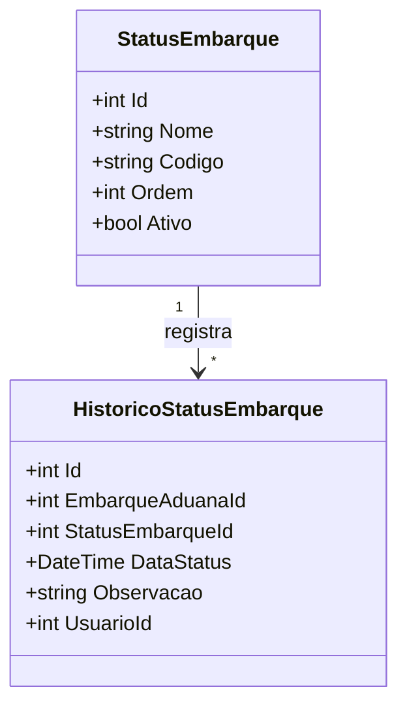
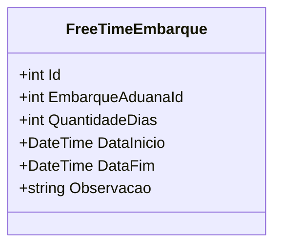
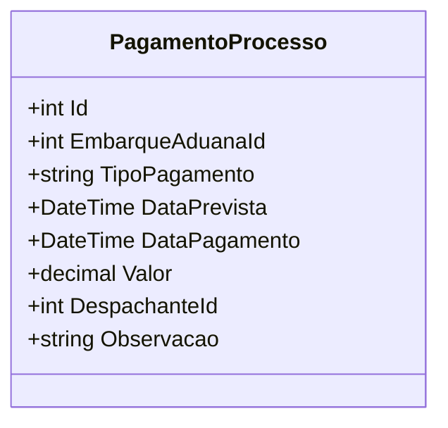
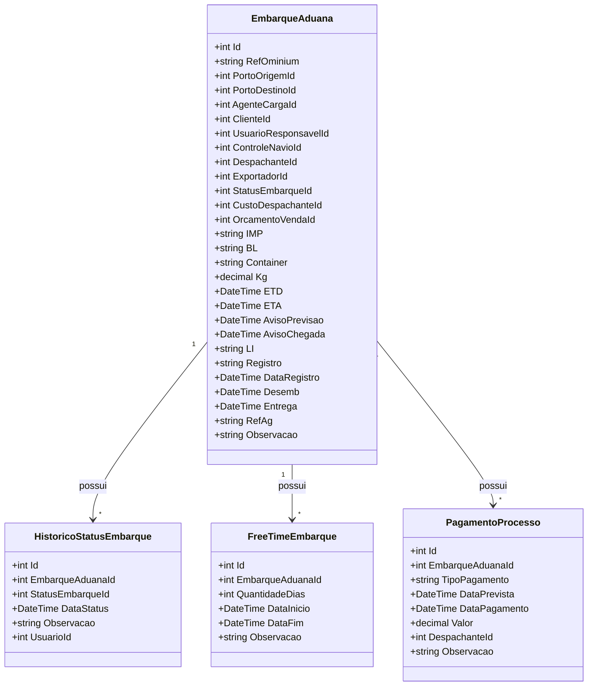
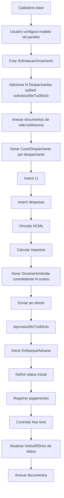
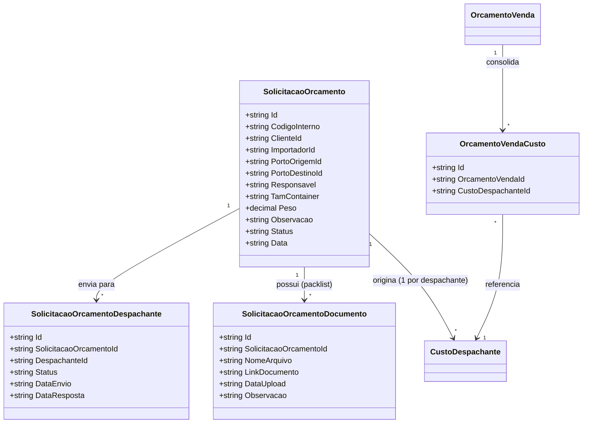

# Nova modelagem ajustada — Sistema Aduana / Orçamento / Embarque

## Objetivo
Esta versão ajustada melhora a modelagem anterior para evitar excesso de campos em `EmbarqueAduana` e separar melhor:

- **solicitação de orçamento** (ponto de entrada do processo);
- segurança e acesso;
- cadastros base;
- configuração de planilha;
- custo do despachante;
- orçamento de venda;
- embarque;
- navio/viagem;
- pagamentos do processo;
- histórico de status;
- free time;
- documentos genéricos.

O foco é deixar o sistema mais escalável e mais fácil de implementar.

---

# 1. Blocos do sistema

## 1.0 Solicitação de Orçamento ⭐ NOVO
- SolicitacaoOrcamento
- SolicitacaoOrcamentoDespachante
- SolicitacaoOrcamentoDocumento

## 1.1 Segurança e acesso
- Cargos
- NivelAcesso
- Usuarios

## 1.2 Cadastros base
- Clientes
- Importadores
- Despachantes
- PortosOrigem
- PortosDestino
- CadastroFabricantes
- Exportadores
- AgentesCarga
- Ncm
- ListaPrecoLcl

## 1.3 Configuração de planilha
- ModeloPacklist
- ModeloPacklistCampo

## 1.4 Controle logístico
- ControleNavio
- ControleNavioTrajeto

## 1.5 Custo interno
- CustoDespachante (`solicitacaoOrcamentoId?` ⭐ NOVO)
- CustoDespachanteLi
- CustoDespachanteDespesa
- NcmVinculadoOrcamento
- ValorImposto

## 1.6 Comercial
- OrcamentoVenda
- OrcamentoVendaDespesa
- OrcamentoVendaDespesaExtra
- OrcamentoVendaCusto ⭐ NOVO (junction N:N com CustoDespachante)

## 1.7 Operação
- EmbarqueAduana
- StatusEmbarque
- HistoricoStatusEmbarque
- FreeTimeEmbarque
- PagamentoProcesso

## 1.8 Documentos
- TipoDocumento
- Documento
- DocumentoVinculo

---

# 2. Diagrama principal de classes

```mermaid
classDiagram

    class SolicitacaoOrcamento {
        +string Id
        +string CodigoInterno
        +string ClienteId
        +string ImportadorId
        +string PortoOrigemId
        +string PortoDestinoId
        +string ResponsavelId
        +string TamContainer
        +decimal Peso
        +string Observacao
        +string Status
        +string Data
    }

    class SolicitacaoOrcamentoDespachante {
        +string Id
        +string SolicitacaoOrcamentoId
        +string DespachanteId
        +string Status
        +string DataEnvio
        +string DataResposta
    }

    class SolicitacaoOrcamentoDocumento {
        +string Id
        +string SolicitacaoOrcamentoId
        +string NomeArquivo
        +string LinkDocumento
        +string DataUpload
        +string Observacao
    }

    class OrcamentoVendaCusto {
        +string Id
        +string OrcamentoVendaId
        +string CustoDespachanteId
    }

    class Cargo {
        +int Id
        +string Nome
        +string Descricao
        +bool Ativo
    }

    class NivelAcesso {
        +int Id
        +string Nome
        +int Ordem
        +string Descricao
        +bool Ativo
    }

    class Usuario {
        +int Id
        +int CargoId
        +int NivelAcessoId
        +string Nome
        +string Email
        +string Login
        +string SenhaHash
        +bool Ativo
        +DateTime DataCadastro
    }

    class Cliente {
        +int Id
        +string Nome
        +string Documento
        +string Email
        +string Telefone
        +bool Ativo
        +DateTime DataCadastro
    }

    class Importador {
        +int Id
        +string RazaoSocial
        +string Cnpj
        +string Email
        +string Telefone
        +bool Ativo
    }

    class Despachante {
        +int Id
        +string Nome
        +string Documento
        +string Email
        +string Telefone
        +bool Ativo
    }

    class PortoOrigem {
        +int Id
        +string Nome
        +string Codigo
        +string Pais
        +bool Ativo
    }

    class PortoDestino {
        +int Id
        +string Nome
        +string Codigo
        +string Estado
        +string Pais
        +bool Ativo
    }

    class CadastroFabricante {
        +int Id
        +string Nome
        +string Pais
        +string Cidade
        +string Contato
        +bool Ativo
    }

    class Exportador {
        +int Id
        +string Nome
        +string Documento
        +string Pais
        +string Cidade
        +bool Ativo
    }

    class AgenteCarga {
        +int Id
        +string Nome
        +string Documento
        +string Pais
        +string Contato
        +bool Ativo
    }

    class Ncm {
        +int Id
        +string CodigoNcm
        +string Descricao
        +decimal AliqII
        +decimal AliqIPI
        +decimal AliqPIS
        +decimal AliqCOFINS
        +decimal AliqICMS
        +bool Ativo
    }

    class ListaPrecoLcl {
        +int Id
        +string Categoria
        +string Descricao
        +string NomeChines
        +decimal PrecoUsdPorCbm
        +decimal PrecoUsdPorKg
        +DateTime DataVigencia
        +bool Ativo
    }

    class ModeloPacklist {
        +int Id
        +int UsuarioId
        +string Nome
        +string Descricao
        +bool EhPadrao
        +int LinhaInicialLeitura
        +bool PossuiCabecalho
        +bool Ativo
        +DateTime DataCriacao
    }

    class ModeloPacklistCampo {
        +int Id
        +int ModeloPacklistId
        +string CampoSistema
        +string ColunaExcel
        +string NomeColunaEsperada
        +bool Obrigatorio
        +string Formato
        +int Ordem
    }

    class ControleNavio {
        +int Id
        +string NumeroViagem
        +string NomeNavio
        +string Observacao
        +bool Ativo
    }

    class ControleNavioTrajeto {
        +int Id
        +int ControleNavioId
        +int PortoOrigemId
        +int PortoDestinoId
        +DateTime ETD
        +DateTime ETA
        +string TrajetoDescricao
    }

    class CustoDespachante {
        +int Id
        +string CodigoInterno
        +int DespachanteId
        +int ImportadorId
        +int PortoOrigemId
        +int PortoDestinoId
        +string Responsavel
        +string SolicitacaoOrcamentoId
        +decimal Peso
        +decimal FobUsd
        +decimal FobReais
        +decimal CifUsd
        +decimal CifReais
        +decimal SeguroUsd
        +decimal TaxaUsd
        +decimal TaxaUsdAgente
        +string TamContainer
        +DateTime Data
        +string Observacao
    }
    %% ⭐ Responsavel = texto livre (não FK de Usuario)
    %% ⭐ ModeloPacklistId removido — não implementado no frontend
    %% ⭐ SolicitacaoOrcamentoId: FK opcional (gerado automaticamente ao gerar custo a partir de solicitação)

    class CustoDespachanteLi {
        +int Id
        +int CustoDespachanteId
        +string Ncm
        +string Descricao
        +decimal Valor
        +DateTime Data
    }

    class CustoDespachanteDespesa {
        +int Id
        +int CustoDespachanteId
        +string Descricao
        +decimal Valor
        +DateTime Data
        +bool EntraBaseIcms
    }

    class NcmVinculadoOrcamento {
        +int Id
        +int CustoDespachanteId
        +int NcmId
        +string NumeroNcm
        +string Descricao
        +decimal AliIpi
        +decimal AliIi
        +decimal AliPis
        +decimal AliCofins
        +decimal AliIcms
        +decimal BaseCalculo
    }

    class ValorImposto {
        +int Id
        +int NcmVinculadoOrcamentoId
        +decimal AliIpi
        +decimal ValorIpi
        +decimal AliIi
        +decimal ValorIi
        +decimal AliPis
        +decimal ValorPis
        +decimal AliCofins
        +decimal ValorCofins
        +decimal AliIcms
        +decimal ValorIcms
        +decimal TotalImpostos
    }

    class OrcamentoVenda {
        +int Id
        +int ClienteId
        +int CustoDespachanteId
        +DateTime Data
        +string TipoProduto
        +string TamContainer
        +decimal PesoBruto
        +decimal PesoLiquido
        +decimal FreteInternacional
        +decimal CifReais
        +decimal CifUsd
        +decimal FobReais
        +decimal FobUsd
        +decimal TaxaUsd
        +decimal Honorarios
        +decimal TotalImpostos
        +decimal TotalDespesas
        +decimal TotalExtras
        +decimal TotalGeral
        +string Observacao
    }
    %% ⭐ CustoDespachanteId: legado/opcional — relação N:N via OrcamentoVendaCusto (1 orçamento → N custos)

    class OrcamentoVendaDespesa {
        +int Id
        +int OrcamentoVendaId
        +string Descricao
        +decimal Valor
    }

    class OrcamentoVendaDespesaExtra {
        +int Id
        +int OrcamentoVendaId
        +string Descricao
        +decimal Valor
    }

    class StatusEmbarque {
        +int Id
        +string Nome
        +string Codigo
        +int Ordem
        +bool Ativo
    }

    class EmbarqueAduana {
        +int Id
        +string RefOminium
        +int PortoOrigemId
        +int PortoDestinoId
        +int AgenteCargaId
        +int ClienteId
        +int UsuarioResponsavelId
        +int ControleNavioId
        +int DespachanteId
        +int ExportadorId
        +int StatusEmbarqueId
        +int CustoDespachanteId
        +int OrcamentoVendaId
        +string IMP
        +string BL
        +string Container
        +decimal Kg
        +DateTime ETD
        +DateTime ETA
        +DateTime AvisoPrevisao
        +DateTime AvisoChegada
        +string LI
        +string Registro
        +DateTime DataRegistro
        +DateTime Desemb
        +DateTime Entrega
        +string RefAg
        +string Observacao
    }

    class HistoricoStatusEmbarque {
        +int Id
        +int EmbarqueAduanaId
        +int StatusEmbarqueId
        +DateTime DataStatus
        +string Observacao
        +int UsuarioId
    }

    class FreeTimeEmbarque {
        +int Id
        +int EmbarqueAduanaId
        +int QuantidadeDias
        +DateTime DataInicio
        +DateTime DataFim
        +string Observacao
    }

    class PagamentoProcesso {
        +int Id
        +int EmbarqueAduanaId
        +string TipoPagamento
        +DateTime DataPrevista
        +DateTime DataPagamento
        +decimal Valor
        +int DespachanteId
        +string Observacao
    }

    class TipoDocumento {
        +int Id
        +string Nome
        +string Codigo
        +string Categoria
        +bool Ativo
    }

    class Documento {
        +int Id
        +int TipoDocumentoId
        +int UsuarioUploadId
        +string NomeOriginal
        +string NomeSalvo
        +string CaminhoArquivo
        +string Extensao
        +string ContentType
        +long TamanhoBytes
        +DateTime DataUpload
        +string HashArquivo
        +string Observacao
    }

    class DocumentoVinculo {
        +int Id
        +int DocumentoId
        +string Entidade
        +int EntidadeId
        +string Papel
        +DateTime DataVinculo
    }

    Cargo "1" --> "*" Usuario : classifica
    NivelAcesso "1" --> "*" Usuario : controla
    Usuario "1" --> "*" ModeloPacklist : cria
    ModeloPacklist "1" --> "*" ModeloPacklistCampo : possui

    ControleNavio "1" --> "*" ControleNavioTrajeto : possui
    PortoOrigem "1" --> "*" ControleNavioTrajeto : origem
    PortoDestino "1" --> "*" ControleNavioTrajeto : destino

    SolicitacaoOrcamento "1" --> "*" SolicitacaoOrcamentoDespachante : envia para
    SolicitacaoOrcamento "1" --> "*" SolicitacaoOrcamentoDocumento : possui (packlist)
    SolicitacaoOrcamento "1" --> "*" CustoDespachante : origina (1 por despachante)
    Despachante "1" --> "*" SolicitacaoOrcamentoDespachante : responde
    PortoOrigem "1" --> "*" SolicitacaoOrcamento : origem
    PortoDestino "1" --> "*" SolicitacaoOrcamento : destino
    %% ⭐ SolicitacaoOrcamento.Responsavel = texto livre, sem FK de Usuario

    Despachante "1" --> "*" CustoDespachante : atende
    Importador "1" --> "*" CustoDespachante : utiliza
    PortoOrigem "1" --> "*" CustoDespachante : origem
    PortoDestino "1" --> "*" CustoDespachante : destino
    %% ⭐ CustoDespachante.Responsavel = texto livre, sem FK de Usuario; ModeloPacklist NÃO vinculado
    CustoDespachante "1" --> "*" CustoDespachanteLi : possui
    CustoDespachante "1" --> "*" CustoDespachanteDespesa : possui
    CustoDespachante "1" --> "*" NcmVinculadoOrcamento : possui
    Ncm "1" --> "*" NcmVinculadoOrcamento : referencia
    NcmVinculadoOrcamento "1" --> "1" ValorImposto : gera

    Cliente "1" --> "*" OrcamentoVenda : recebe
    OrcamentoVenda "1" --> "*" OrcamentoVendaCusto : consolida
    OrcamentoVendaCusto "*" --> "1" CustoDespachante : referencia
    OrcamentoVenda "1" --> "*" OrcamentoVendaDespesa : possui
    OrcamentoVenda "1" --> "*" OrcamentoVendaDespesaExtra : possui

    Cliente "1" --> "*" EmbarqueAduana : contratante
    Usuario "1" --> "*" EmbarqueAduana : responsavel
    AgenteCarga "1" --> "*" EmbarqueAduana : agente
    Despachante "1" --> "*" EmbarqueAduana : despacha
    Exportador "1" --> "*" EmbarqueAduana : exporta
    ControleNavio "1" --> "*" EmbarqueAduana : navio
    PortoOrigem "1" --> "*" EmbarqueAduana : origem
    PortoDestino "1" --> "*" EmbarqueAduana : destino
    StatusEmbarque "1" --> "*" EmbarqueAduana : atual
    CustoDespachante "1" --> "*" EmbarqueAduana : base
    OrcamentoVenda "1" --> "*" EmbarqueAduana : venda

    EmbarqueAduana "1" --> "*" HistoricoStatusEmbarque : historico
    StatusEmbarque "1" --> "*" HistoricoStatusEmbarque : registra
    Usuario "1" --> "*" HistoricoStatusEmbarque : altera

    EmbarqueAduana "1" --> "*" FreeTimeEmbarque : controla
    EmbarqueAduana "1" --> "*" PagamentoProcesso : pagamentos
    Despachante "1" --> "*" PagamentoProcesso : recebe

    TipoDocumento "1" --> "*" Documento : classifica
    Usuario "1" --> "*" Documento : envia
    Documento "1" --> "*" DocumentoVinculo : vincula
```



---

# 3. Ajustes feitos nesta versão

## 3.1 `EmbarqueAduana` ficou mais limpo
Antes ele concentrava quase tudo em uma tabela só.

Agora foram extraídos:
- `StatusEmbarque`
- `HistoricoStatusEmbarque`
- `FreeTimeEmbarque`
- `PagamentoProcesso`

Isso reduz duplicação e facilita controle histórico.

---

# 4. Novo bloco: status do embarque

## `StatusEmbarque`
Tabela mestre com os status possíveis.

Exemplos:
- Previsto
- Aguardando
- Atracado
- Registrado
- Desembaraçado
- Entregue
- Finalizado

## `HistoricoStatusEmbarque`
Guarda cada mudança de status do embarque:
- qual status entrou;
- quando entrou;
- quem alterou;
- observação.

## Diagrama



---

# 5. Novo bloco: free time

## `FreeTimeEmbarque`
Em vez de gravar só texto, agora o free time vira uma tabela.

Campos:
- quantidade de dias;
- data início;
- data fim;
- observação.

Isso ajuda a calcular vencimento e alertas.

## Diagrama



---

# 6. Novo bloco: pagamentos do processo

## `PagamentoProcesso`
Serve para controlar:
- cobrança de sinal;
- sinal pago para qual despachante;
- fechamento pago;
- outros pagamentos do processo.

### Campo `TipoPagamento`
Exemplos:
- CobrancaSinal
- SinalPago
- FechamentoPago
- Honorario
- Outro

### Benefício
Você deixa de depender de campos fixos e passa a registrar quantos pagamentos precisar.

## Diagrama



---

# 7. Como fica o embarque agora

## `EmbarqueAduana` guarda apenas o núcleo do processo
Campos principais:
- referência;
- portos;
- agente;
- cliente;
- responsável;
- ETD / ETA;
- aviso previsão;
- aviso chegada;
- IMP;
- BL;
- container;
- KG;
- navio;
- status atual;
- despachante;
- LI;
- registro;
- data registro;
- desemb;
- entrega;
- exportador;
- ref ag;
- vínculo com custo e venda.

## O que saiu dele
- pagamentos detalhados;
- histórico de status;
- free time estruturado.

---

# 8. Diagrama focado em embarque ajustado



---

# 9. Modelo relacional simplificado

```mermaid
erDiagram
    CARGO ||--o{ USUARIO : classifica
    NIVEL_ACESSO ||--o{ USUARIO : controla

    USUARIO ||--o{ MODELO_PACKLIST : cria
    MODELO_PACKLIST ||--o{ MODELO_PACKLIST_CAMPO : possui

    CONTROLE_NAVIO ||--o{ CONTROLE_NAVIO_TRAJETO : possui

    %%  ⭐ SOLICITACAO_ORCAMENTO.Responsavel = texto livre, sem FK de Usuario
    PORTO_ORIGEM ||--o{ SOLICITACAO_ORCAMENTO : origem
    PORTO_DESTINO ||--o{ SOLICITACAO_ORCAMENTO : destino
    SOLICITACAO_ORCAMENTO ||--o{ SOLICITACAO_ORCAMENTO_DESPACHANTE : envia_para
    DESPACHANTE ||--o{ SOLICITACAO_ORCAMENTO_DESPACHANTE : responde
    SOLICITACAO_ORCAMENTO ||--o{ SOLICITACAO_ORCAMENTO_DOCUMENTO : possui
    SOLICITACAO_ORCAMENTO ||--o{ CUSTO_DESPACHANTE : origina

    DESPACHANTE ||--o{ CUSTO_DESPACHANTE : atende
    IMPORTADOR ||--o{ CUSTO_DESPACHANTE : utiliza
    PORTO_ORIGEM ||--o{ CUSTO_DESPACHANTE : origem
    PORTO_DESTINO ||--o{ CUSTO_DESPACHANTE : destino
    %%  ⭐ CUSTO_DESPACHANTE.Responsavel = texto livre; ModeloPacklist NÃO vinculado no frontend
    USUARIO ||--o{ CUSTO_DESPACHANTE : responsavel

    CUSTO_DESPACHANTE ||--o{ CUSTO_DESPACHANTE_LI : possui
    CUSTO_DESPACHANTE ||--o{ CUSTO_DESPACHANTE_DESPESA : possui
    CUSTO_DESPACHANTE ||--o{ NCM_VINCULADO_ORCAMENTO : possui
    NCM ||--o{ NCM_VINCULADO_ORCAMENTO : referencia
    NCM_VINCULADO_ORCAMENTO ||--|| VALOR_IMPOSTO : gera

    CLIENTE ||--o{ ORCAMENTO_VENDA : recebe
    ORCAMENTO_VENDA ||--o{ ORCAMENTO_VENDA_CUSTO : consolida
    ORCAMENTO_VENDA_CUSTO }o--|| CUSTO_DESPACHANTE : referencia
    ORCAMENTO_VENDA ||--o{ ORCAMENTO_VENDA_DESPESA : possui
    ORCAMENTO_VENDA ||--o{ ORCAMENTO_VENDA_DESPESA_EXTRA : possui

    STATUS_EMBARQUE ||--o{ EMBARQUE_ADUANA : atual
    CLIENTE ||--o{ EMBARQUE_ADUANA : contratante
    USUARIO ||--o{ EMBARQUE_ADUANA : responsavel
    AGENTE_CARGA ||--o{ EMBARQUE_ADUANA : agente
    DESPACHANTE ||--o{ EMBARQUE_ADUANA : despacha
    EXPORTADOR ||--o{ EMBARQUE_ADUANA : exporta
    CONTROLE_NAVIO ||--o{ EMBARQUE_ADUANA : navio
    CUSTO_DESPACHANTE ||--o{ EMBARQUE_ADUANA : base
    ORCAMENTO_VENDA ||--o{ EMBARQUE_ADUANA : venda

    EMBARQUE_ADUANA ||--o{ HISTORICO_STATUS_EMBARQUE : historico
    STATUS_EMBARQUE ||--o{ HISTORICO_STATUS_EMBARQUE : registra
    EMBARQUE_ADUANA ||--o{ FREE_TIME_EMBARQUE : controla
    EMBARQUE_ADUANA ||--o{ PAGAMENTO_PROCESSO : pagamentos

    TIPO_DOCUMENTO ||--o{ DOCUMENTO : classifica
    USUARIO ||--o{ DOCUMENTO : envia
    DOCUMENTO ||--o{ DOCUMENTO_VINCULO : vincula
```



---

# 10. Regras de implementação

## Integridade
Não permitir:
- usuário sem cargo;
- usuário sem nível de acesso;
- custo despachante sem despachante;
- custo despachante sem importador;
- valor imposto sem NCM vinculado;
- embarque sem custo base;
- embarque sem cliente;
- histórico de status sem embarque;
- pagamento sem embarque.

## Exclusão sugerida
Ao excluir `CustoDespachante`, excluir também:
- LI;
- despesas;
- NCMs vinculados;
- valor imposto.

Ao excluir `OrcamentoVenda`, excluir:
- despesas;
- despesas extras.

Ao excluir `EmbarqueAduana`, excluir:
- histórico de status;
- free time;
- pagamentos do processo;
- vínculos documentais.

Ao excluir vínculos de documento:
- o arquivo físico só pode ser apagado quando não existir mais nenhum vínculo.

---

# 11. Fluxo do processo



---

# 12. Resumo executivo

## Estrutura central
```text
Usuários + Cargos + Nível de acesso
    ↓
SolicitacaoOrcamento  ⭐ ponto de entrada
    ↓ (1 solicitação → N despachantes)
CustoDespachante  (1 por despachante que responde)
    ↓
LI + Despesas + NCM Vinculado + Impostos
    ↓
OrcamentoVenda  (consolida N custos via OrcamentoVendaCusto)
    ↓
EmbarqueAduana
    ↓
Status + Histórico + Pagamentos + FreeTime + Documentos
```

## Melhorias desta versão
- embarque menos pesado;
- status separado em tabela própria;
- histórico de status completo;
- pagamentos flexíveis;
- free time estruturado;
- melhor base para alertas, dashboard e financeiro;
- **solicitação de orçamento como ponto de entrada formal do processo**;
- **suporte a N despachantes por solicitação** via `SolicitacaoOrcamentoDespachante`;
- **orçamento de venda consolidando N custos** via `OrcamentoVendaCusto`.

---

# 13. Novo bloco: solicitação de orçamento ⭐

## Contexto

Antes desta versão, o fluxo começava diretamente em `CustoDespachante`. Isso não registrava formalmente quem pediu a cotação, para quais despachantes foi solicitada, nem os documentos de referência (proforma, invoice).

`SolicitacaoOrcamento` resolve isso: é criada pelo responsável (usuário logado), informa os portos, container, peso e seleciona N despachantes. Cada despachante que responde gera um `CustoDespachante` vinculado à solicitação. O `OrcamentoVenda` então consolida os custos dos N despachantes via `OrcamentoVendaCusto`.

## `SolicitacaoOrcamento`

Campos principais:
- código interno (SOL-AAAA-NNN);
- cliente ou importador (opcional);
- porto origem e porto destino (obrigatórios);
- responsável (**texto livre** — nome digitado pelo usuário, não FK);
- tamanho do container (`'20' | '40' | 'LCL'`);
- peso;
- observação;
- status (`Rascunho | Aberta | EmAnalise | Aprovada | Cancelada`);
- data.

### Fluxo de Status

```
Rascunho  ──→  Aberta  ──→  EmAnalise  ──→  Aprovada
   ↑                                    └──→  Cancelada
(ao salvar)  (ao gerar CustoDespachante)
```

- **Rascunho**: status inicial ao criar/salvar uma solicitação.
- **Aberta**: definido automaticamente ao acionar "Gerar CustoDespachante". Neste momento, um registro de `CustoDespachante` é criado para cada despachante da lista.
- **EmAnalise / Aprovada / Cancelada**: transições manuais posteriores.

## `SolicitacaoOrcamentoDespachante`

Junction entre solicitação e despachante:
- qual despachante foi consultado;
- data de envio;
- data de resposta (preenchida quando CustoDespachante é gerado);
- status (`Pendente | Respondido | Recusado`).

## `SolicitacaoOrcamentoDocumento`

Seção chamada **"Packlist"** na interface — permite anexar o arquivo de packlist durante a criação/edição de uma solicitação:
- nome do arquivo (`nomeArquivo` — obrigatório);
- link do documento (`linkDocumento` — armazena o nome/path local do arquivo; será URL após integração com API/Blob Storage);
- data de upload;
- observação.

> **Visibilidade no CustoDespachante:** o despachante visualiza o packlist da solicitação origem no passo 1 do wizard (somente leitura). A opção de download está disponível; enquanto não houver API, exibe alerta de que o arquivo estará disponível na versão com backend.

> **Nota:** diferente de `Documento` (que armazena Base64), `SolicitacaoOrcamentoDocumento` armazena apenas um link. Essa separação é intencional — os packlists são referências externas do fornecedor que chegam antes do processo operacional.

## `OrcamentoVendaCusto`

Junction entre `OrcamentoVenda` e `CustoDespachante`:
- permite que um orçamento compare várias propostas de despachantes;
- substitui o antigo campo `custoDespachanteId` em `OrcamentoVenda`.

## Diagrama


